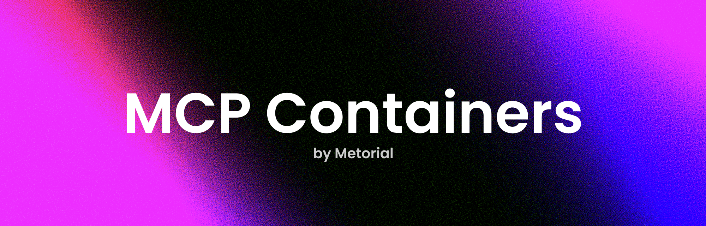

<h1 align="center">MCP Containers</h1>

Containerized versions of hundreds of <a href="https://modelcontextprotocol.io">MCP servers</a> 📡 🧠

## Features

- **🚀 Simple Setup** - Just pull the Docker image to use any MCP server
- **🛠️ Always Up-to-Date** - We automatically update the images daily
- **🔒 Secure** - Run MCP servers in isolated containers

## Motivation

While experimenting with Model Context Protocol (MCP) servers, we found that setting them up could be a bit tedious and time-consuming. 
To simplify the process, we created containerized versions of these servers—making it quick, easy, and secure for anyone to get started.

This repository contains the scripts we use to build and manage these containers using [Nixpacks](https://nixpacks.com). 
New images are automatically built whenever changes are made to the corresponding server repositories, 
ensuring that our containers are always up-to-date.

We're committed to supporting as many MCP servers as possible. 
If there's a specific server you'd like to see included, feel free to open an issue or submit a pull request!

## Usage

To use the containers, simply pull the Docker image for the server you want to use. 
We have provided a list of available servers below, along with their respective readme files.

## Featured Servers

-  **[21st.dev Magic AI Agent
](catalog/21st-dev/magic-mcp/magic-mcp/README.md)** - Magic Component Platform (MCP) is a powerful AI-driven tool that helps developers create beautiful, modern UI components instantly through natural language descriptions. It integrates seamlessly with popular IDEs and provides a streamlined workflow for UI development.

-  **[🏆 Audiense Insights MCP Server
](catalog/AudienseCo/mcp-audiense-insights/mcp-audiense-insights/README.md)** - This server, based on the [Model Context Protocol (MCP)](https://github.com/modelcontextprotocol), allows **Claude** or any other MCP-compatible client to interact with your [Audiense Insights](https://www.audiense.com/) account. It extracts **marketing insights and audience analysis** from Audiense reports, covering **demographic, cultural, influencer, and content engagement analysis**.

-  **[CircleCI MCP Server
](catalog/CircleCI-Public/mcp-server-circleci/mcp-server-circleci/README.md)** - Model Context Protocol (MCP) is a [new, standardized protocol](https://modelcontextprotocol.io/introduction) for managing context between large language models (LLMs) and external systems. In this repository, we provide an MCP Server for [CircleCI](https://circleci.com).

-  **[Watsonx.ai Flows Engine
](catalog/IBM/wxflows/javascript/README.md)** - Here's a step-by-step tutorial for setting up and deploying a project with wxflows, including installing necessary tools, deploying the app, and running it locally.

-  **[Octagon: MCP For Market Data
](catalog/OctagonAI/octagon-mcp-server/octagon-mcp-server/README.md)** - A free Model Context Protocol (MCP) server that integrates with Octagon Market Intelligence API

-  **[MCP Server for Paddle Billing
](catalog/PaddleHQ/paddle-mcp-server/paddle-mcp-server/README.md)** - This is a [Model Context Protocol (MCP)](https://modelcontextprotocol.io/introduction) server that provides tools for interacting with the Paddle API.

-  **[Unstructured API MCP Server
](catalog/Unstructured-IO/UNS-MCP/uns-mcp/README.md)** - An MCP server implementation for interacting with the Unstructured API. This server provides tools to list sources and workflows.

-  **[Verodat MCP Server
](catalog/Verodat/verodat-mcp-server/verodat-mcp-server/README.md)** - Verodat MCP Server Implementation

-  **[Xero MCP Server
](catalog/XeroAPI/xero-mcp-server/xero-mcp-server/README.md)** - This is a Model Context Protocol (MCP) server implementation for Xero. It provides a bridge between the MCP protocol and Xero's API, allowing for standardized access to Xero's accounting and business features.

-  **[Apify Model Context Protocol (MCP) Server
](catalog/apify/actors-mcp-server/actors-mcp-server/README.md)** - Implementation of an MCP server for all [Apify Actors](https://apify.com/store).

-  **[APIMatic Validator MCP Server
](catalog/apimatic/apimatic-validator-mcp/apimatic-validator-mcp/README.md)** - This repository provides a Model Context Protocol (MCP) Server for validating OpenAPI specifications using [APIMatic](https://www.apimatic.io/). The server processes OpenAPI files and returns validation summaries by leveraging APIMatic’s API.

-  **[mcp-server-axiom
](catalog/axiomhq/mcp-server-axiom/mcp-server-axiom/README.md)** - A [Model Context Protocol](https://modelcontextprotocol.io/) server implementation for [Axiom](https://axiom.co) that enables AI agents to query your data using Axiom Processing Language (APL).

-  **[Base MCP Server 🔵
](catalog/base/base-mcp/base-mcp/README.md)** - A Model Context Protocol (MCP) server that provides onchain tools for AI applications like Claude Desktop and Cursor, allowing them to interact with the Base Network and Coinbase API.

-  **[Browserbase MCP Server
](catalog/browserbase/mcp-server-browserbase/browserbase/README.md)** - This server provides cloud browser automation capabilities using [Browserbase](https://www.browserbase.com/), [Puppeteer](https://pptr.dev/), and [Stagehand](https://github.com/browserbase/stagehand). This server enables LLMs to interact with web pages, take screenshots, and execute JavaScript in a cloud browser environment.

-  **[Chargebee Model Context Protocol (MCP) Server
](catalog/chargebee/agentkit/modelcontextprotocol/README.md)** - Model Context Protocol (MCP) is a [standardized protocol](https://modelcontextprotocol.io/introduction) designed to manage context between large language models (LLMs) and external systems.

-  **[Chroma MCP Server
](catalog/chroma-core/chroma-mcp/chroma-mcp/README.md)** - This server provides data retrieval capabilities powered by Chroma, enabling AI models to create collections over generated data and user inputs, and retrieve that data using vector search, full text search, metadata filtering, and more.

-  **[Cloudflare MCP Server
](catalog/cloudflare/mcp-server-cloudflare/mcp-server-cloudflare/README.md)** - Model Context Protocol (MCP) is a [new, standardized protocol](https://modelcontextprotocol.io/introduction) for managing context between large language models (LLMs) and external systems. In this repository, we provide an installer as well as an MCP Server for [Cloudflare's API](https://api.cloudflare.com).

-  **[Opik MCP Server
](catalog/comet-ml/opik-mcp/opik-mcp/README.md)** - Opik MCP Server is an open-source implementation of the Model Context Protocol for the Opik platform. It provides a unified interface for interacting with Opik's capabilities, supporting multiple transport mechanisms for flexible integration into various environments.

-  **[DevHub CMS MCP
](catalog/devhub/devhub-cms-mcp/devhub-cms-mcp/README.md)** - A [Model Context Protocol (MCP)](https://modelcontextprotocol.io/) integration for managing content in the [DevHub CMS system](https://www.devhub.com/).

-  **[Inbox Zero MCP Server
](catalog/elie222/inbox-zero/mcp-server/README.md)** - An MCP server to manage your inbox efficiently. Use it within Cursor, Windsurf, or Claude desktop to interact with your Inbox Zero personal assistant.

-  **[Exa MCP Server 🔍
](catalog/exa-labs/exa-mcp-server/exa-mcp-server/README.md)** - A Model Context Protocol (MCP) server lets AI assistants like Claude use the Exa AI Search API for web searches. This setup allows AI models to get real-time web information in a safe and controlled way.

-  **[gotoHuman MCP Server
](catalog/gotohuman/gotohuman-mcp-server/gotohuman-mcp-server/README.md)** - Let your **AI agents ask for human reviews** in gotoHuman via MCP.

-  **[Model Context Protocol (MCP) Server for Graphlit Platform
](catalog/graphlit/graphlit-mcp-server/graphlit-mcp-server/README.md)** - Model Context Protocol (MCP) Server for Graphlit Platform

-  **[heroku-mcp-server
](catalog/heroku/heroku-mcp-server/heroku-mcp-server/README.md)** - The Heroku Platform MCP Server works on Common Runtime, Cedar Private and Shield Spaces, and Fir Private Spaces.

-  **[Hyperbrowser MCP Server
](catalog/hyperbrowserai/mcp/mcp/README.md)** - This is Hyperbrowser's Model Context Protocol (MCP) Server. It provides various tools to scrape, extract structured data, and crawl webpages. It also provides easy access to general purpose browser agents like OpenAI's CUA, Anthropic's Claude Computer Use, and Browser Use.

-  **[Make MCP Server
](catalog/integromat/make-mcp-server/make-mcp-server/README.md)** - A Model Context Protocol server that enables Make scenarios to be utilized as tools by AI assistants. This integration allows AI systems to trigger and interact with your Make automation workflows.

-  **[Dart MCP Server
](catalog/its-dart/dart-mcp-server/dart-mcp-server/README.md)** - Dart AI Model Context Protocol (MCP) server

-  **[ForeverVM MCP Server
](catalog/jamsocket/forevervm/mcp-server/README.md)** - MCP Server for ForeverVM, enabling Claude to execute code in a Python REPL.

-  **[Notion MCP Server
](catalog/makenotion/notion-mcp-server/notion-mcp-server/README.md)** - This project implements an [MCP server](https://spec.modelcontextprotocol.io/) for the [Notion API](https://developers.notion.com/reference/intro).

-  **[Firecrawl MCP Server
](catalog/mendableai/firecrawl-mcp-server/firecrawl-mcp-server/README.md)** - A Model Context Protocol (MCP) server implementation that integrates with [Firecrawl](https://github.com/mendableai/firecrawl) for web scraping capabilities.

-  **[metoro-mcp-server
](catalog/metoro-io/metoro-mcp-server/metoro-mcp-server/README.md)** - This repository contains th Metoro MCP (Model Context Protocol) Server. This MCP Server allows you to interact with your Kubernetes cluster via the Claude Desktop App!

-  **[Playwright MCP
](catalog/microsoft/playwright-mcp/playwright-mcp/README.md)** - A Model Context Protocol (MCP) server that provides browser automation capabilities using [Playwright](https://playwright.dev). This server enables LLMs to interact with web pages through structured accessibility snapshots, bypassing the need for screenshots or visually-tuned models.

-  **[Needle MCP Server
](catalog/needle-ai/needle-mcp/needle-mcp/README.md)** - MCP (Model Context Protocol) server to manage documents and perform searches using [Needle](https://needle-ai.com) through Claude’s Desktop Application.

-  **[Neon MCP Server
](catalog/neondatabase/mcp-server-neon/mcp-server-neon/README.md)** - **Neon MCP Server** is an open-source tool that lets you interact with your Neon Postgres databases in **natural language**.

-  **[mcp-oceanbase
](catalog/oceanbase/mcp-oceanbase/mcp-oceanbase/README.md)** - MCP Server for OceanBase database and its tools

-  **[Oxylabs MCP Server
](catalog/oxylabs/oxylabs-mcp/oxylabs-mcp/README.md)** - The Oxylabs MCP server provides a bridge between AI models and the web. It enables them to scrape any URL, render JavaScript-heavy pages, extract and format content for AI use, bypass anti-scraping measures, and access geo-restricted web data from 195+ countries.

-  **[Logfire MCP Server
](catalog/pydantic/logfire-mcp/logfire-mcp/README.md)** - This repository contains a Model Context Protocol (MCP) server with tools that can access the OpenTelemetry traces and

-  **[mcp-server-qdrant: A Qdrant MCP server
](catalog/qdrant/mcp-server-qdrant/mcp-server-qdrant/README.md)** - An official Qdrant Model Context Protocol (MCP) server implementation.

-  **[ramp-mcp: A Ramp MCP server
](catalog/ramp-public/ramp-mcp/ramp-mcp/README.md)** - A Model Context Protocol server for retrieving and analyzing data or running tasks for Ramp using Developer API. In order to get around token and input size limitations, this server implements a simple ETL pipeline + ephemeral sqlite database in memory for analysis by an LLM.

-  **[ScreenshotOne MCP Server
](catalog/screenshotone/mcp/mcp/README.md)** - A simple implementation of an MCP server for the ScreenshotOne API

-  **[Semgrep MCP Server
](catalog/semgrep/mcp/mcp/README.md)** - A Model Context Protocol (MCP) server for using [Semgrep](https://semgrep.dev) to scan code for security vulnerabilities. Secure your [vibe coding](https://semgrep.dev/blog/2025/giving-appsec-a-seat-at-the-vibe-coding-table/)! 😅

-  **[Stripe Model Context Protocol
](catalog/stripe/agent-toolkit/modelcontextprotocol/README.md)** - The Stripe [Model Context Protocol](https://modelcontextprotocol.com/) server allows you to integrate with Stripe APIs through function calling. This protocol supports various tools to interact with different Stripe services.

-  **[Tavily MCP Server
](catalog/tavily-ai/tavily-mcp/tavily-mcp/README.md)** - An MCP server for Tavily search.

-  **[Tinybird MCP server
](catalog/tinybirdco/mcp-tinybird/mcp-tinybird/README.md)** - An MCP server to interact with a Tinybird Workspace from any MCP client.

-  **[Lara Translate MCP Server
](catalog/translated/lara-mcp/lara-mcp/README.md)** - A Model Context Protocol (MCP) Server for [Lara Translate](https://laratranslate.com/translate) API, enabling powerful translation capabilities with support for language detection and context-aware translations.

-  **[Vectorize MCP Server
](catalog/vectorize-io/vectorize-mcp-server/vectorize-mcp-server/README.md)** - A Model Context Protocol (MCP) server implementation that integrates with [Vectorize](https://vectorize.io/) for advanced Vector retrieval and text extraction.

## Available Servers

-  **[Job Searchoor MCP Server
](catalog/0xDAEF0F/job-searchoor/job-searchoor/README.md)** - An MCP server implementation that provides job search functionality.

-  **[MCP Content Summarizer Server
](catalog/0xshellming/mcp-summarizer/mcp-summarizer/README.md)** - A Model Context Protocol (MCP) server that provides intelligent summarization capabilities for various types of content using Google's Gemini 1.5 Pro model. This server can help you generate concise summaries while maintaining key information from different content formats.

-  **[21st.dev Magic AI Agent
](catalog/21st-dev/magic-mcp/magic-mcp/README.md)** - Magic Component Platform (MCP) is a powerful AI-driven tool that helps developers create beautiful, modern UI components instantly through natural language descriptions. It integrates seamlessly with popular IDEs and provides a streamlined workflow for UI development.

-  **[Bilibili MCP
](catalog/34892002/bilibili-mcp-js/bilibili-mcp-js/README.md)** - MCP server for Bilibili search.

-  **[Deepseek R1 MCP Server
](catalog/66julienmartin/MCP-server-Deepseek_R1/mcp-server-deepseek-r-1/README.md)** - A Model Context Protocol (MCP) server implementation for the Deepseek R1 language model. Deepseek R1 is a powerful language model optimized for reasoning tasks with a context window of 8192 tokens.

-  **[AI Agent Marketplace Index Search MCP Server
](catalog/AI-Agent-Hub/ai-agent-marketplace-index-mcp/ai-agent-marketplace-index-mcp/README.md)** - MCP Server for AI Agent Marketplace Index from DeepNLP, , allowing AI assistants to searches available AI agents Navigation Page function, tools or use cases by "keywords" or "category". such as find all the "AI coding agents", "GUI AI Agents", "Mobile Use Agent", "Desktop Use Agent", etc.

-  **[MCP Chat Desktop App
](catalog/AI-QL/chat-mcp/chat-mcp/README.md)** - A Cross-Platform Interface for LLMs

-  **[₿itcoin & Lightning Network MCP Server
](catalog/AbdelStark/bitcoin-mcp/bitcoin-mcp/README.md)** - Bitcoin & Lightning Network MCP Server.

-  **[🌐 Nostr MCP Server
](catalog/AbdelStark/nostr-mcp/nostr-mcp/README.md)** - A Model Context Protocol (MCP) server that enables AI models to interact with Nostr, allowing them to post notes and interact with the freedom of speech protocol.

-  **[Discourse MCP Server
](catalog/AshDevFr/discourse-mcp-server/discourse-mcp-server/README.md)** - Node.js server implementing Model Context Protocol (MCP) for Discourse search operation.

-  **[🏆 Audiense Insights MCP Server
](catalog/AudienseCo/mcp-audiense-insights/mcp-audiense-insights/README.md)** - This server, based on the [Model Context Protocol (MCP)](https://github.com/modelcontextprotocol), allows **Claude** or any other MCP-compatible client to interact with your [Audiense Insights](https://www.audiense.com/) account. It extracts **marketing insights and audience analysis** from Audiense reports, covering **demographic, cultural, influencer, and content engagement analysis**.

-  **[MCP Server Playwright
](catalog/Automata-Labs-team/MCP-Server-Playwright/mcp-server-playwright/README.md)** - MCP Server for interacting with Browsers using Playwright.

-  **[notion-mcp
](catalog/Badhansen/notion-mcp/notion-mcp/README.md)** - A simple Model Context Protocol (MCP) server that integrates with Notion's API to manage my personal todo list.

-  **[Bankless Onchain MCP Server
](catalog/Bankless/onchain-mcp/onchain-mcp/README.md)** - MCP (Model Context Protocol) server for blockchain data interaction through the Bankless API.

-  **[Clojars MCP Server
](catalog/Bigsy/Clojars-MCP-Server/clojars-mcp-server/README.md)** - A [Model Context Protocol (MCP)](https://github.com/ModelContext/protocol) server that provides tools for fetching dependency information from [Clojars](https://clojars.org/), the Clojure community's artifact repository for Cline, Roo Code, Cody, Claude Desktop etc.

-  **[Starwind UI MCP Server
](catalog/Boston343/starwind-ui-mcp/starwind-ui-mcp/README.md)** - A TypeScript implementation of a Model Context Protocol (MCP) server for Starwind UI, providing tools to help developers work with Starwind UI components.

-  **[Maigret MCP Server
](catalog/BurtTheCoder/mcp-maigret/mcp-maigret/README.md)** - A Model Context Protocol (MCP) server for [maigret](https://github.com/soxoj/maigret), a powerful OSINT tool that collects user account information from various public sources. This server provides tools for searching usernames across social networks and analyzing URLs. It is designed to integrate seamlessly with MCP-compatible applications like [Claude Desktop](https://claude.ai).

-  **[Shodan MCP Server
](catalog/BurtTheCoder/mcp-shodan/mcp-shodan/README.md)** - A Model Context Protocol (MCP) server for querying the [Shodan API](https://shodan.io) and [Shodan CVEDB](https://cvedb.shodan.io). This server provides comprehensive access to Shodan's network intelligence and security services, including IP reconnaissance, DNS operations, vulnerability tracking, and device discovery. All tools provide structured, formatted output for easy analysis and integration.

-  **[VirusTotal MCP Server
](catalog/BurtTheCoder/mcp-virustotal/mcp-virustotal/README.md)** - A Model Context Protocol (MCP) server for querying the [VirusTotal API](https://www.virustotal.com/). This server provides comprehensive security analysis tools with automatic relationship data fetching. It integrates seamlessly with MCP-compatible applications like [Claude Desktop](https://claude.ai).

-  **[Google News MCP Server
](catalog/ChanMeng666/server-google-news/server-google-news/README.md)** - Model Context Protocol (MCP) server implementation providing Google News search capabilities via SerpAPI, with automatic news categorization and multi-language support.

-  **[Keycloak MCP Server
](catalog/ChristophEnglisch/keycloak-model-context-protocol/keycloak-model-context-protocol/README.md)** - A Model Context Protocol server for Keycloak administration, providing tools to manage users and realms.

-  **[CircleCI MCP Server
](catalog/CircleCI-Public/mcp-server-circleci/mcp-server-circleci/README.md)** - Model Context Protocol (MCP) is a [new, standardized protocol](https://modelcontextprotocol.io/introduction) for managing context between large language models (LLMs) and external systems. In this repository, we provide an MCP Server for [CircleCI](https://circleci.com).

-  **[DeepSeek MCP Server
](catalog/DMontgomery40/deepseek-mcp-server/deepseek-mcp-server/README.md)** - A Model Context Protocol (MCP) server for the DeepSeek API, allowing seamless integration of DeepSeek's powerful language models with MCP-compatible applications like Claude Desktop.

-  **[Dumpling AI MCP Server
](catalog/Dumpling-AI/mcp-server-dumplingai/mcp-server-dumplingai/README.md)** - A Model Context Protocol (MCP) server implementation that integrates with Dumpling AI for data scraping, content processing, knowledge management, AI agents, and code execution capabilities.

-  **[EduBase MCP server
](catalog/EduBase/MCP/mcp/README.md)** - Model Context Protocol server **for the EduBase platform**. It allows MCP clients (for example Claude Desktop) and LLMs to interact with your EduBase account and perform tasks on your behalf.

-  **[MCP Server Kubernetes
](catalog/Flux159/mcp-server-kubernetes/mcp-server-kubernetes/README.md)** - MCP Server that can connect to a Kubernetes cluster and manage it.

-  **[Framelink Figma MCP Server
](catalog/GLips/Figma-Context-MCP/figma-context-mcp/README.md)** - Give your coding agent access to your Figma data. Implement designs in any framework in one-shot.

-  **[Datadog MCP Server
](catalog/GeLi2001/datadog-mcp-server/datadog-mcp-server/README.md)** - A Model Context Protocol (MCP) server for interacting with the Datadog API.

-  **[Shopify MCP Server
](catalog/GeLi2001/shopify-mcp/shopify-mcp/README.md)** - MCP Server for Shopify API, enabling interaction with store data through GraphQL API. This server provides tools for managing products, customers, orders, and more.

-  **[TFT MCP Server
](catalog/GeLi2001/tft-mcp-server/tft-mcp-server/README.md)** - This is a Model Context Protocol (MCP) server for Team Fight Tactics (TFT) that provides access to TFT game data through various tools.

-  **[JSON MCP Server (@gongrzhe/server-json-mcp@1.0.3)
](catalog/GongRzhe/JSON-MCP-Server/json-mcp-server/README.md)** - A JSON Model Context Protocol (MCP) server implementation for querying and manipulating JSON data. This server enables LLMs to interact with JSON data through a set of standardized tools.

-  **[Langflow-DOC-QA-SERVER
](catalog/GongRzhe/Langflow-DOC-QA-SERVER/langflow-doc-qa-server/README.md)** - A Model Context Protocol server for document Q\&A powered by Langflow

-  **[quickchart-server MCP Server
](catalog/GongRzhe/Quickchart-MCP-Server/quickchart-mcp-server/README.md)** - A Model Context Protocol server for generating charts using QuickChart.io . It allows you to create various types of charts through MCP tools.

-  **[语雀 MCP 服务器
](catalog/HenryHaoson/Yuque-MCP-Server/yuque-mcp-server/README.md)** - 一个用于与语雀 API 集成的 Model-Context-Protocol (MCP) 服务器。此实现受 [Figma-Context-MCP](https://github.com/GLips/Figma-Context-MCP) 的启发，并使用 [语雀开放 API](https://app.swaggerhub.com/apis-docs/Jeff-Tian/yuque-open_api/2.0.1)。

-  **[QA Sphere MCP Server
](catalog/Hypersequent/qasphere-mcp/qasphere-mcp/README.md)** - A [Model Context Protocol](https://github.com/modelcontextprotocol) server for the [QA Sphere](https://qasphere.com/) test management system.

-  **[Watsonx.ai Flows Engine
](catalog/IBM/wxflows/javascript/README.md)** - Here's a step-by-step tutorial for setting up and deploying a project with wxflows, including installing necessary tools, deploying the app, and running it locally.

-  **[Image Compression
](catalog/InhiblabCore/mcp-image-compression/mcp-image-compression/README.md)** - A high-performance image compression microservice based on MCP (Modal Context Protocol)

-  **[JetBrains MCP Proxy Server
](catalog/JetBrains/mcp-jetbrains/mcp-jetbrains/README.md)** - The server proxies requests from client to JetBrains IDE.

-  **[JetBrains MCP Proxy Server
](catalog/JetBrains/mcpProxy/mcp-proxy/README.md)** - The server proxies requests from client to JetBrains IDE.

-  **[Databricks MCP Server
](catalog/JordiNeil/mcp-databricks-server/mcp-databricks-server/README.md)** - A Model Context Protocol (MCP) server that connects to Databricks API, allowing LLMs to run SQL queries, list jobs, and get job status.

-  **[App Store Connect MCP Server
](catalog/JoshuaRileyDev/app-store-connect-mcp-server/app-store-connect-mcp-server/README.md)** - A Model Context Protocol (MCP) server for interacting with the App Store Connect API. This server provides tools for managing apps, beta testers, bundle IDs, devices, and capabilities in App Store Connect.

-  **[Confluence Communication Server MCP Server
](catalog/KS-GEN-AI/confluence-mcp-server/confluence-mcp-server/README.md)** - Interact with Confluence

-  **[Jira communication server MCP Server
](catalog/KS-GEN-AI/jira-mcp-server/jira-mcp-server/README.md)** - Talk to Jira

-  **[Kong Konnect MCP Server
](catalog/Kong/mcp-konnect/mcp-konnect/README.md)** - A Model Context Protocol (MCP) server for interacting with Kong Konnect APIs, allowing AI assistants to query and analyze Kong Gateway configurations, traffic, and analytics.

-  **[National Parks MCP Server
](catalog/KyrieTangSheng/mcp-server-nationalparks/mcp-server-nationalparks/README.md)** - MCP Server for the National Park Service (NPS) API, providing real-time information about U.S. National Parks, including park details, alerts, and activities.

-  **[TMDB MCP Server
](catalog/Laksh-star/mcp-server-tmdb/mcp-server-tmdb/README.md)** - This MCP server integrates with The Movie Database (TMDB) API to provide movie information, search capabilities, and recommendations.

-  **[Octagon: MCP For Market Data
](catalog/OctagonAI/octagon-mcp-server/octagon-mcp-server/README.md)** - A free Model Context Protocol (MCP) server that integrates with Octagon Market Intelligence API

-  **[octomind mcp server: let agents create and manage e2e tests
](catalog/OctoMind-dev/octomind-mcp/octomind-mcp/README.md)** - An MCP server for octomind tools, resources and prompts

-  **[Open Data Model Context Protocol
](catalog/OpenDataMCP/OpenDataMCP/open-data-mcp/README.md)** - Connect any Open Data to any LLM with Model Context Protocol.

-  **[MCP Server for Paddle Billing
](catalog/PaddleHQ/paddle-mcp-server/paddle-mcp-server/README.md)** - This is a [Model Context Protocol (MCP)](https://modelcontextprotocol.io/introduction) server that provides tools for interacting with the Paddle API.

-  **[PostHog MCP Server 📊
](catalog/PostHog/posthog-mcp/posthog-mcp/README.md)** - A Model Context Protocol (MCP) server for interacting with PostHog. Create annotations and manage projects directly through Claude Desktop!

-  **[NASA MCP Server
](catalog/ProgramComputer/NASA-MCP-server/nasa-mcp-server/README.md)** - A Model Context Protocol (MCP) server for NASA APIs, providing a standardized interface for AI models to interact with NASA's vast array of data sources. This server implements the official Model Context Protocol specification.

-  **[JMeter MCP Server
](catalog/QAInsights/jmeter-mcp-server/jmeter-mcp-server/README.md)** - This is a Model Context Protocol (MCP) server that allows executing JMeter tests through MCP-compatible clients.

-  **[k6-mcp-server
](catalog/QAInsights/k6-mcp-server/k-6-mcp-server/README.md)** - A Model Context Protocol (MCP) server implementation for running k6 load tests.

-  **[locust-mcp-server
](catalog/QAInsights/locust-mcp-server/locust-mcp-server/README.md)** - A Model Context Protocol (MCP) server implementation for running Locust load tests. This server enables seamless integration of Locust load testing capabilities with AI-powered development environments.

-  **[Coincap MCP
](catalog/QuantGeekDev/coincap-mcp/coincap-mcp/README.md)** - A coincap mcp server to access crypto data from coincap API.

-  **[Docker MCP
](catalog/QuantGeekDev/docker-mcp/docker-mcp/README.md)** - A powerful Model Context Protocol (MCP) server for Docker operations, enabling seamless container and compose stack management through Claude AI.

-  **[🗄️ MongoDB MCP Server for LLMS
](catalog/QuantGeekDev/mongo-mcp/mongo-mcp/README.md)** - A Model Context Protocol (MCP) server that enables LLMs to interact directly with MongoDB databases. Query collections, inspect schemas, and manage data seamlessly through natural language.

-  **[@reapi/mcp-openapi
](catalog/ReAPI-com/mcp-openapi/mcp-openapi/README.md)** - A Model Context Protocol (MCP) server that loads and serves multiple OpenAPI specifications to enable LLM-powered IDE integrations. This server acts as a bridge between your OpenAPI specifications and LLM-powered development tools like Cursor and other code editors.

-  **[Rootly MCP Server
](catalog/Rootly-AI-Labs/Rootly-MCP-server/rootly-mcp-server/README.md)** - An MCP server for [Rootly API](https://docs.rootly.com/api-reference/overview) that you can plug into your favorite MCP-compatible editors like Cursor, Windsurf, and Claude. Resolve production incidents in under a minute without leaving your IDE.

-  **[MCP Claude Code
](catalog/SDGLBL/mcp-claude-code/mcp-claude-code/README.md)** - An implementation of Claude Code capabilities using the Model Context Protocol (MCP).

-  **[Crypto Trader MCP Tool
](catalog/SaintDoresh/Crypto-Trader-MCP-ClaudeDesktop/crypto-trader-mcp-claude-desktop/README.md)** - An MCP (Model Context Protocol) tool that provides cryptocurrency market data using the CoinGecko API, specifically designed for Claude Desktop.

-  **[Weather MCP Tool
](catalog/SaintDoresh/Weather-MCP-ClaudeDesktop/weather-mcp-claude-desktop/README.md)** - An MCP (Model Context Protocol) tool that provides real-time weather data, forecasts, and historical weather information using the OpenWeatherMap API, specifically designed for Claude Desktop.

-  **[YFinance Trader MCP Tool for Claude Desktop
](catalog/SaintDoresh/YFinance-Trader-MCP-ClaudeDesktop/yfinance-trader-mcp-claude-desktop/README.md)** - An MCP (Model Context Protocol) tool that provides stock market data and trading capabilities using the yfinance library, specifically adapted for Claude Desktop.

-  **[Discord MCP
](catalog/SaseQ/discord-mcp/discord-mcp/README.md)** - A [Model Context Protocol (MCP)](https://modelcontextprotocol.io/introduction) server for the Discord API [(JDA)](https://jda.wiki/),

-  **[MCP-searxng
](catalog/SecretiveShell/MCP-searxng/mcp-searxng/README.md)** - An MCP server for connecting agentic systems to search systems via [searXNG](https://docs.searxng.org/).

-  **[MCP-timeserver
](catalog/SecretiveShell/MCP-timeserver/mcp-timeserver/README.md)** - A simple MCP server that exposes datetime information to agentic systems and chat REPLs

-  **[MCP-wolfram-alpha
](catalog/SecretiveShell/MCP-wolfram-alpha/mcp-wolfram-alpha/README.md)** - A MCP server to connect to wolfram alpha API.

-  **[&#x20;TikTok MCP
](catalog/Seym0n/tiktok-mcp/tiktok-mcp/README.md)** - The TikTok MCP integrates TikTok access into Claude AI and other apps via TikNeuron. This TikTok MCP allows you to

-  **[OpenCTI MCP Server
](catalog/Spathodea-Network/opencti-mcp/opencti-mcp/README.md)** - OpenCTI MCP Server is a Model Context Protocol (MCP) server that provides seamless integration with OpenCTI (Open Cyber Threat Intelligence) platform.

-  **[Starrocks Official MCP server
](catalog/StarRocks/mcp-server-starrocks/mcp-server-starrocks/README.md)** - The StarRocks MCP Server acts as a bridge between AI assistants and StarRocks databases, allowing for direct SQL execution and database exploration without requiring complex setup or configuration.

-  **[📦 BNBChain MCP – Binance Smart Chain Tool Server (MCP + CLI Ready)
](catalog/TermiX-official/bsc-mcp/bsc-mcp/README.md)** - A plug-and-play MCP tool server to **send BNB**, **transfer BEP-20 tokens**, **deploy tokens**, and **interact with smart contracts** on the **Binance Smart Chain (BSC)** — built for **Claude Desktop**, **AI agents**, and **developers.**

-  **[Azure DevOps MCP Server
](catalog/Tiberriver256/mcp-server-azure-devops/mcp-server-azure-devops/README.md)** - A Model Context Protocol (MCP) server implementation for Azure DevOps, allowing AI assistants to interact with Azure DevOps APIs through a standardized protocol.

-  **[tavily-search MCP server
](catalog/Tomatio13/mcp-server-tavily/mcp-server-tavily/README.md)** - This server uses the Tavily API to perform searches based on specified queries.

-  **[Unstructured API MCP Server
](catalog/Unstructured-IO/UNS-MCP/uns-mcp/README.md)** - An MCP server implementation for interacting with the Unstructured API. This server provides tools to list sources and workflows.

-  **[Didlogic MCP Server
](catalog/UserAd/didlogic_mcp/didlogic-mcp/README.md)** - A Model Context Protocol (MCP) server implementation for the Didlogic API. This server allows Large Language Models (LLMs) to interact with Didlogic services through a standardized interface.

-  **[Verodat MCP Server
](catalog/Verodat/verodat-mcp-server/verodat-mcp-server/README.md)** - Verodat MCP Server Implementation

-  **[VeyraX MCP
](catalog/VeyraX/veyrax-mcp/veyrax-mcp/README.md)** - **Single tool to control them all** — VeyraX MCP is the only connection you need to access all your tools in any MCP-compatible environment.

-  **[MCP Azure DevOps Server
](catalog/Vortiago/mcp-azure-devops/mcp-azure-devops/README.md)** - A Model Context Protocol (MCP) server enabling AI assistants to interact with Azure DevOps services.

-  **[Xero MCP Server
](catalog/XeroAPI/xero-mcp-server/xero-mcp-server/README.md)** - This is a Model Context Protocol (MCP) server implementation for Xero. It provides a bridge between the MCP protocol and Xero's API, allowing for standardized access to Xero's accounting and business features.

-  **[Model Context Protocol Server for Apache OpenDAL™
](catalog/Xuanwo/mcp-server-opendal/mcp-server-opendal/README.md)** - A Model Context Protocol (MCP) server implementation that provides access to various storage services via [Apache OpenDAL™](https://opendal.apache.org/).

-  **[Multi-Model Advisor
](catalog/YuChenSSR/multi-ai-advisor-mcp/multi-ai-advisor-mcp/README.md)** - A Model Context Protocol (MCP) server that queries multiple Ollama models and combines their responses, providing diverse AI perspectives on a single question.

-  **[go-mcp-mysql
](catalog/Zhwt/go-mcp-mysql/go-mcp-mysql/README.md)** - Zero burden, ready-to-use Model Context Protocol (MCP) server for interacting with MySQL and automation.

-  **[ClaudePost
](catalog/ZilongXue/claude-post/claude-post/README.md)** - A Model Context Protocol (MCP) server that provides a seamless email management interface through Claude. This integration allows you to handle emails directly through natural language conversations with Claude, supporting features like searching, reading, and sending emails securely.

-  **[Todoist MCP Server
](catalog/abhiz123/todoist-mcp-server/todoist-mcp-server/README.md)** - An MCP (Model Context Protocol) server implementation that integrates Claude with Todoist, enabling natural language task management. This server allows Claude to interact with your Todoist tasks using everyday language.

-  **[kagi-server MCP Server
](catalog/ac3xx/mcp-servers-kagi/mcp-servers-kagi/README.md)** - MCP server for Kagi API integration

-  **[Google Search MCP Server
](catalog/adenot/mcp-google-search/mcp-google-search/README.md)** - A Model Context Protocol server that provides web search capabilities using Google Custom Search API and webpage content extraction functionality.

-  **[mcp-scholarly MCP server
](catalog/adityak74/mcp-scholarly/mcp-scholarly/README.md)** - A MCP server to search for accurate academic articles. More scholarly vendors will be added soon.

-  **[FileScopeMCP (Model Context Protocol) Server
](catalog/admica/FileScopeMCP/file-scope-mcp/README.md)** - **✨ Instantly understand and visualize your codebase structure & dependencies! ✨**

-  **[AgentMail MCP Integration
](catalog/agentmail-to/agentmail-toolkit/mcp/README.md)** - A simple **Model Context Protocol (MCP)** server that integrates with [AgentMail](https://agentmail.to) to dynamically manage email inboxes, list messages, and send or reply to emails—all through an AI assistant such as Claude. This reference implementation demonstrates how to use AgentMail’s API within an MCP server to orchestrate email inboxes on the fly.

-  **[BICScan MCP Server
](catalog/ahnlabio/bicscan-mcp/bicscan-mcp/README.md)** - A powerful and efficient Blockchain address risk scoring API MCP Server, leveraging the BICScan API to provide comprehensive risk assessments and asset information for blockchain addresses, domains, and decentralized applications (dApps).

-  **[Bear MCP Server
](catalog/akseyh/bear-mcp-server/bear-mcp-server/README.md)** - This project is a Model Context Protocol (MCP) server that provides access to the [Bear Notes](https://bear.app).

-  **[🪐 MCP IPFS Server (storacha.network) 🛰️
](catalog/alexbakers/mcp-ipfs/mcp-ipfs/README.md)** - A Node.js server implementing the [Model Context Protocol (MCP)](https://github.com/ModelContextProtocol/specification) for interacting with the [storacha.network](https://storacha.network/) platform via the w3 command-line interface (@web3-storage/w3cli).

-  **[mcp-server-home-assistant
](catalog/allenporter/mcp-server-home-assistant/mcp-server-home-assistant/README.md)** - A Model Context Protocol Server for Home Assistant. See [Model Context Protocol](https://modelcontextprotocol.io/)

-  **[simctl-mcp
](catalog/ambar/simctl-mcp/simctl-mcp/README.md)** - A Model Context Protocol server implementation for iOS Simulator control.

-  **[Unichat MCP Server in Python
](catalog/amidabuddha/unichat-mcp-server/unichat-mcp-server/README.md)** - ASend requests to OpenAI, MistralAI, Anthropic, xAI, Google AI, DeepSeek, Alibaba, Inception using MCP protocol via tool or predefined prompts.

-  **[mcp-installer - A MCP Server to install MCP Servers
](catalog/anaisbetts/mcp-installer/mcp-installer/README.md)** - This server is a server that installs other MCP servers for you. Install it, and you can ask Claude to install MCP servers hosted in npm or PyPi for you. Requires npx and uv to be installed for node and Python servers respectively.

-  **[MCP Simple OpenAI Assistant
](catalog/andybrandt/mcp-simple-openai-assistant/mcp-simple-openai-assistant/README.md)** - *AI assistants are pretty cool. I thought it would be a good idea if my Claude (conscious Claude) would also have one. And now he has - and its both useful anf fun for him. Your Claude can have one too!*

-  **[MCP Simple PubMed
](catalog/andybrandt/mcp-simple-pubmed/mcp-simple-pubmed/README.md)** - An MCP server that provides access to PubMed articles through the Entrez API.

-  **[NYTimes Article Search MCP Server
](catalog/angheljf/nyt/nyt/README.md)** - This is a TypeScript-based MCP server that allows searching for New York Times articles from the last 30 days based on a keyword. It demonstrates core MCP concepts by providing:

-  **[Coinmarket MCP server
](catalog/anjor/coinmarket-mcp-server/coinmarket-mcp-server/README.md)** - An MCP server that integrates with the Coinmarket API

-  **[MCP XMind Server
](catalog/apeyroux/mcp-xmind/mcp-xmind/README.md)** - A Model Context Protocol server for analyzing and querying XMind mind maps. This tool provides powerful capabilities for searching, extracting, and analyzing content from XMind files.

-  **[APISIX Model Context Protocol (MCP) Server
](catalog/api7/apisix-mcp/apisix-mcp/README.md)** - APISIX Model Context Protocol (MCP) server is used to bridge large language models (LLMs) with the APISIX Admin API. It aims to enable natural language-based interaction for viewing and managing resources in APISIX through MCP-compatible AI clients.

-  **[Apify Model Context Protocol (MCP) Server
](catalog/apify/actors-mcp-server/actors-mcp-server/README.md)** - Implementation of an MCP server for all [Apify Actors](https://apify.com/store).

-  **[RAG Web Browser Actor
](catalog/apify/mcp-server-rag-web-browser/mcp-server-rag-web-browser/README.md)** - Implementation of an MCP server for the [RAG Web Browser Actor](https://apify.com/apify/rag-web-browser).

-  **[APIMatic Validator MCP Server
](catalog/apimatic/apimatic-validator-mcp/apimatic-validator-mcp/README.md)** - This repository provides a Model Context Protocol (MCP) Server for validating OpenAPI specifications using [APIMatic](https://www.apimatic.io/). The server processes OpenAPI files and returns validation summaries by leveraging APIMatic’s API.

-  **[piapi-mcp-server
](catalog/apinetwork/piapi-mcp-server/piapi-mcp-server/README.md)** - A TypeScript implementation of a Model Context Protocol (MCP) server that integrates with PiAPI's API. PiAPI makes user able to generate media content with Midjourney/Flux/Kling/LumaLabs/Udio/Chrip/Trellis directly from Claude or any other MCP-compatible apps.

-  **[Google Tasks MCP Server
](catalog/arpitbatra123/mcp-googletasks/mcp-googletasks/README.md)** - This Model Context Protocol (MCP) server provides a bridge between Claude and Google Tasks, allowing you to manage your task lists and tasks directly through Claude.

-  **[Pushover MCP
](catalog/ashiknesin/pushover-mcp/pushover-mcp/README.md)** - A [Model Context Protocol](https://modelcontextprotocol.io/introduction) implementation for sending notifications via [Pushover.net](https://pushover.net).

-  **[MCP Link - Convert Any OpenAPI V3 API to MCP Server
](catalog/automation-ai-labs/mcp-link/mcp-link/README.md)** - Convert Any OpenAPI V3 API to MCP Server

-  **[Replicate Flux MCP
](catalog/awkoy/replicate-flux-mcp/replicate-flux-mcp/README.md)** - MCP for Replicate Flux Model - A powerful tool for generating customized images and SVG assets that match specific coding vibes and aesthetic styles. Streamline your visual asset creation process with AI-powered design generation tailored for developers.

-  **[S3 Model Context Protocol Server
](catalog/aws-samples/sample-mcp-server-s3/sample-mcp-server-s-3/README.md)** - An MCP server implementation for retrieving  data such as PDF's from S3.

-  **[TaskWarrior MCP Server
](catalog/awwaiid/mcp-server-taskwarrior/mcp-server-taskwarrior/README.md)** - Node.js server implementing Model Context Protocol (MCP) for [TaskWarrior](https://taskwarrior.org/) operations.

-  **[mcp-server-axiom
](catalog/axiomhq/mcp-server-axiom/mcp-server-axiom/README.md)** - A [Model Context Protocol](https://modelcontextprotocol.io/) server implementation for [Axiom](https://axiom.co) that enables AI agents to query your data using Axiom Processing Language (APL).

-  **[Baidu AI Search
](catalog/baidubce/app-builder/ai-search/README.md)** - Baidu AI Search component combines Baidu's search capabilities with large language model technology to provide intelligent responses with real-time web information references, supporting various industry application scenarios. It offers rich standardized capabilities such as:

-  **[Bankless Onchain MCP Server
](catalog/bankless/onchain-mcp/onchain-mcp/README.md)** - MCP (Model Context Protocol) server for blockchain data interaction through the Bankless API.

-  **[Bear MCP Server
](catalog/bart6114/my-bear-mcp-server/my-bear-mcp-server/README.md)** - A Model Context Protocol (MCP) server that allows AI assistants like Claude to read notes from the [Bear](https://bear.app/) note-taking app. This implementation connects directly to the Bear SQLite database in a read-only mode, ensuring your notes remain safe and unmodified.

-  **[Base MCP Server 🔵
](catalog/base/base-mcp/base-mcp/README.md)** - A Model Context Protocol (MCP) server that provides onchain tools for AI applications like Claude Desktop and Cursor, allowing them to interact with the Base Network and Coinbase API.

-  **[Basic Memory
](catalog/basicmachines-co/basic-memory/basic-memory/README.md)** - Basic Memory lets you build persistent knowledge through natural conversations with Large Language Models (LLMs) like

-  **[MCP Code Executor
](catalog/bazinga012/mcp_code_executor/mcp-code-executor/README.md)** - The MCP Code Executor is an MCP server that allows LLMs to execute Python code within a specified Conda environment. This enables LLMs to run code with access to libraries and dependencies defined in the Conda environment.

-  **[MCP Server for MySQL
](catalog/benborla/mcp-server-mysql/mcp-server-mysql/README.md)** - A Model Context Protocol server that provides access to MySQL databases. This server enables LLMs to inspect database schemas and execute SQL queries.

-  **[Whois MCP
](catalog/bharathvaj-ganesan/whois-mcp/whois-mcp/README.md)** - MCP Server for whois lookups.

-  **[Neovim MCP Server
](catalog/bigcodegen/mcp-neovim-server/mcp-neovim-server/README.md)** - A proof of concept integration between Claude Desktop (or any client) and Neovim using Model Context Protocol (MCP) and the official neovim/node-client JavaScript library. This server leverages Vim's native text editing commands and workflows, which Claude already understands, to create a lightweight code or general purpose AI text assistance layer.

-  **[mcp-graphql
](catalog/blurrah/mcp-graphql/mcp-graphql/README.md)** - A Model Context Protocol server that enables LLMs to interact with GraphQL APIs. This implementation provides schema introspection and query execution capabilities, allowing models to discover and use GraphQL APIs dynamically.

-  **[IP Geolocation MCP Server
](catalog/briandconnelly/mcp-server-ipinfo/mcp-server-ipinfo/README.md)** - This is a simple [Model Context Protocol](https://modelcontextprotocol.io) server that uses the [ipinfo.io](https://ipinfo.io) API to get detailed information about an IP address.

-  **[Browserbase MCP Server
](catalog/browserbase/mcp-server-browserbase/browserbase/README.md)** - This server provides cloud browser automation capabilities using [Browserbase](https://www.browserbase.com/), [Puppeteer](https://pptr.dev/), and [Stagehand](https://github.com/browserbase/stagehand). This server enables LLMs to interact with web pages, take screenshots, and execute JavaScript in a cloud browser environment.

-  **[HubSpot MCP Server
](catalog/buryhuang/mcp-hubspot/mcp-hubspot/README.md)** - A Model Context Protocol (MCP) server implementation that provides integration with HubSpot CRM. This server enables AI models to interact with HubSpot data and operations through a standardized interface.

-  **[Alphavantage MCP Server
](catalog/calvernaz/alphavantage/alphavantage/README.md)** - A MCP server for the stock market data API, Alphavantage API.

-  **[Mac Messages MCP
](catalog/carterlasalle/mac_messages_mcp/mac-messages-mcp/README.md)** - A Python bridge for interacting with the macOS Messages app using MCP (Multiple Context Protocol).

-  **[CentralMind Gateway
](catalog/centralmind/gateway/gateway/README.md)** - Simple way to expose your database to AI-Agent via MCP or OpenAPI 3.1 protocols.

-  **[Chargebee Model Context Protocol (MCP) Server
](catalog/chargebee/agentkit/modelcontextprotocol/README.md)** - Model Context Protocol (MCP) is a [standardized protocol](https://modelcontextprotocol.io/introduction) designed to manage context between large language models (LLMs) and external systems.

-  **[Telegram MCP Server
](catalog/chigwell/telegram-mcp/telegram-mcp/README.md)** - A Telegram MCP (Model Context Protocol) server built using Python, Telethon, and MCP Python SDK. This MCP server provides simple tools for interacting with Telegram chats directly through MCP-compatible hosts, such as Claude for Desktop.

-  **[Chroma MCP Server
](catalog/chroma-core/chroma-mcp/chroma-mcp/README.md)** - This server provides data retrieval capabilities powered by Chroma, enabling AI models to create collections over generated data and user inputs, and retrieve that data using vector search, full text search, metadata filtering, and more.

-  **[Cloudflare MCP Server
](catalog/cloudflare/mcp-server-cloudflare/mcp-server-cloudflare/README.md)** - Model Context Protocol (MCP) is a [new, standardized protocol](https://modelcontextprotocol.io/introduction) for managing context between large language models (LLMs) and external systems. In this repository, we provide an installer as well as an MCP Server for [Cloudflare's API](https://api.cloudflare.com).

-  **[➡️ attestable-mcp-server
](catalog/co-browser/attestable-mcp-server/attestable-mcp-server/README.md)** - Verify that any MCP server is running the intended and untampered code via hardware attestation.

-  **[browser-use-mcp-server
](catalog/co-browser/browser-use-mcp-server/browser-use-mcp-server/README.md)** - An MCP server that enables AI agents to control web browsers using browser-use.

-  **[Opik MCP Server
](catalog/comet-ml/opik-mcp/opik-mcp/README.md)** - Opik MCP Server is an open-source implementation of the Model Context Protocol for the Opik platform. It provides a unified interface for interacting with Opik's capabilities, supporting multiple transport mechanisms for flexible integration into various environments.

-  **[mcp-confluent
](catalog/confluentinc/mcp-confluent/mcp-confluent/README.md)** - An MCP server implementation that enables AI assistants to interact with Confluent Kafka and Confluent Cloud REST APIs. This server allows AI tools like Claude Desktop and Goose CLI to manage Kafka topics, connectors, and Flink SQL statements through natural language interactions.

-  **[Elasticsearch/OpenSearch MCP Server
](catalog/cr7258/elasticsearch-mcp-server/elasticsearch-mcp-server/README.md)** - A Model Context Protocol (MCP) server implementation that provides Elasticsearch and OpenSearch interaction.

-  **[Scrapling Fetch MCP
](catalog/cyberchitta/scrapling-fetch-mcp/scrapling-fetch-mcp/README.md)** - An MCP server that helps AI assistants access text content from websites that implement bot detection, bridging the gap between what you can see in your browser and what the AI can access.

-  **[MCP Neo4j Server
](catalog/da-okazaki/mcp-neo4j-server/mcp-neo-4-j-server/README.md)** - An MCP server that provides integration between Neo4j graph database and Claude Desktop, enabling graph database operations through natural language interactions.

-  **[GitHub Enterprise MCP Server
](catalog/ddukbg/github-enterprise-mcp/github-enterprise-mcp/README.md)** - An MCP (Model Context Protocol) server for integration with GitHub Enterprise API. This server provides an MCP interface to easily access repository information, issues, PRs, and more from GitHub Enterprise in Cursor.

-  **[Replicate MCP Server
](catalog/deepfates/mcp-replicate/mcp-replicate/README.md)** - A [Model Context Protocol](https://github.com/mcp-sdk/mcp) server implementation for Replicate. Run Replicate models through a simple tool-based interface.

-  **[Postman MCP Server
](catalog/delano/postman-mcp-server/postman-mcp-server/README.md)** - An MCP server that provides access to Postman.

-  **[MCP Server for Ticketmaster
](catalog/delorenj/mcp-server-ticketmaster/mcp-server-ticketmaster/README.md)** - A Model Context Protocol server that provides tools for discovering events, venues, and attractions through the Ticketmaster Discovery API.

-  **[Descope MCP Server
](catalog/descope-sample-apps/descope-mcp-server/descope-mcp-server/README.md)** - The Descope Model Context Protocol (MCP) server provides an interface to interact with Descope's Management APIs, enabling the search and retrieval of project-related information.

-  **[trieve-mcp-server
](catalog/devflowinc/trieve/mcp-server/README.md)** - A Model Context Protocol (MCP) server that provides agentic tools for interacting with the Trieve API. This server enables AI agents to search and interact with Trieve datasets through a standardized interface.

-  **[DevHub CMS MCP
](catalog/devhub/devhub-cms-mcp/devhub-cms-mcp/README.md)** - A [Model Context Protocol (MCP)](https://modelcontextprotocol.io/) integration for managing content in the [DevHub CMS system](https://www.devhub.com/).

-  **[MCP Server for Quran.com API
](catalog/djalal/quran-mcp-server/quran-mcp-server/README.md)** - MCP server to interact with Quran.com corpus via the official [REST API v4](https://api-docs.quran.com/docs/content_apis_versioned/4.0.0/content-apis).

-  **[Pulumi MCP Server
](catalog/dogukanakkaya/pulumi-mcp-server/pulumi-mcp-server/README.md)** - An MCP server that provides access to Pulumi.

-  **[airtable-mcp-server
](catalog/domdomegg/airtable-mcp-server/airtable-mcp-server/README.md)** - A Model Context Protocol server that provides read and write access to Airtable databases. This server enables LLMs to inspect database schemas, then read and write records.

-  **[Siri Shortcuts MCP Server
](catalog/dvcrn/mcp-server-siri-shortcuts/mcp-server-siri-shortcuts/README.md)** - This MCP server provides access to Siri shortcuts functionality via the Model Context Protocol (MCP). It allows listing, opening, and running shortcuts from the macOS Shortcuts app.

-  **[Nocodb MCP Server
](catalog/edwinbernadus/nocodb-mcp-server/nocodb-mcp-server/README.md)** - The Nocodb MCP Server enables seamless interaction with a Nocodb database using the Model Context Protocol (MCP). It facilitates CRUD (Create, Read, Update, Delete) operations on Nocodb tables.

-  **[Freshdesk MCP Server
](catalog/effytech/freshdesk_mcp/freshdesk-mcp/README.md)** - An MCP server implementation that integrates with Freshdesk, enabling AI models to interact with Freshdesk modules and perform various support operations.

-  **[Inbox Zero MCP Server
](catalog/elie222/inbox-zero/mcp-server/README.md)** - An MCP server to manage your inbox efficiently. Use it within Cursor, Windsurf, or Claude desktop to interact with your Inbox Zero personal assistant.

-  **[BigQuery MCP Server
](catalog/ergut/mcp-bigquery-server/mcp-bigquery-server/README.md)** - A Model Context Protocol (MCP) server that provides secure, read-only access to BigQuery datasets. Enables Large Language Models (LLMs) to safely query and analyze data through a standardized interface.

-  **[ADLS2 MCP Server
](catalog/erikhoward/adls-mcp-server/adls-mcp-server/README.md)** - A Model Context Protocol (MCP) server implementation for Azure Data Lake Storage Gen2. This service provides a standardized interface for interacting with ADLS2 storage, enabling file operations through MCP tools.

-  **[Hacker News MCP Server
](catalog/erithwik/mcp-hn/mcp-hn/README.md)** - A Model Context Protocol (MCP) server that provides tools for fetching information from Hacker News.

-  **[mcp-miro MCP Server
](catalog/evalstate/mcp-miro/mcp-miro/README.md)** - A Model Context Protocol server to connect to the MIRO Whiteboard Application.

-  **[Exa MCP Server 🔍
](catalog/exa-labs/exa-mcp-server/exa-mcp-server/README.md)** - A Model Context Protocol (MCP) server lets AI assistants like Claude use the Exa AI Search API for web searches. This setup allows AI models to get real-time web information in a safe and controlled way.

-  **[Playwright MCP Server 🎭
](catalog/executeautomation/mcp-playwright/mcp-playwright/README.md)** - A Model Context Protocol server that provides browser automation capabilities using Playwright. This server enables LLMs to interact with web pages, take screenshots, generate test code, web scraps the page and execute JavaScript in a real browser environment.

-  **[File Merger MCP Server
](catalog/exoticknight/mcp-file-merger/mcp-file-merger/README.md)** - Simple utility to combine multiple files into one. Fast, secure, and easy to use.

-  **[@f4ww4z/mcp-mysql-server
](catalog/f4ww4z/mcp-mysql-server/mcp-mysql-server/README.md)** - A Model Context Protocol server that provides MySQL database operations. This server enables AI models to interact with MySQL databases through a standardized interface.

-  **[Fastn Server
](catalog/fastnai/mcp-fastn/mcp-fastn/README.md)** - The Fastn server is a powerful, scalable platform that enables dynamic tool registration and execution based on API definitions. It seamlessly integrates with services like Claude.ai and Cursor.ai, providing a unified server solution for a wide range of tasks. With its robust architecture, Fastn delivers exceptional performance and flexibility for real-time, API-driven operations.

-  **[Airtable MCP Server
](catalog/felores/airtable-mcp/airtable-mcp/README.md)** - A Model Context Protocol server that provides tools for interacting with Airtable's API. This server enables programmatic management of Airtable bases, tables, fields, and records through Claude Desktop or other MCP clients.

-  **[Cloudinary MCP Server
](catalog/felores/cloudinary-mcp-server/cloudinary-mcp-server/README.md)** - This MCP server provides tools for uploading images and videos to Cloudinary through Claude Desktop and compatible MCP clients.

-  **[investor-agent: A Financial Analysis MCP Server
](catalog/ferdousbhai/investor-agent/investor-agent/README.md)** - A Model Context Protocol server for building an investor agent

-  **[tasty-agent: A TastyTrade MCP Server
](catalog/ferdousbhai/tasty-agent/tasty-agent/README.md)** - Let Claude manage your tastytrade portfolio.

-  **[iterm-mcp
](catalog/ferrislucas/iterm-mcp/iterm-mcp/README.md)** - A Model Context Protocol server that provides access to your iTerm session.

-  **[Flipt MCP Server
](catalog/flipt-io/mcp-server-flipt/mcp-server-flipt/README.md)** - A [Model Context Protocol (MCP)](https://modelcontextprotocol.io/) server for [Flipt](https://flipt.io), allowing AI assistants to interact with feature flags.

-  **[Flowcore Platform MCP Server
](catalog/flowcore-io/mcp-flowcore-platform/mcp-flowcore-platform/README.md)** - A Model Context Protocol (MCP) server for managing and interacting with the Flowcore Platform.

-  **[MongoDB Lens
](catalog/furey/mongodb-lens/mongodb-lens/README.md)** - **MongoDB Lens** is a local Model Context Protocol (MCP) server with full featured access to MongoDB databases using natural language via LLMs to perform queries, run aggregations, optimize performance, and more.

-  **[Firebase MCP Server
](catalog/gannonh/firebase-mcp/firebase-mcp/README.md)** - 🔥 Model Context Protocol (MCP) server for Firebase.

-  **[BioMCP: Biomedical Model Context Protocol
](catalog/genomoncology/biomcp/biomcp/README.md)** - BioMCP is an open source (MIT License) toolkit for biomedical research AI

-  **[Ashra MCP
](catalog/getrupt/ashra-mcp/ashra-mcp/README.md)** - A Model Context Protocol server for Ashra.

-  **[Calculator MCP Server
](catalog/githejie/mcp-server-calculator/mcp-server-calculator/README.md)** - A Model Context Protocol server for calculating. This server enables LLMs to use calculator for precise numerical calculations.

-  **[GitHub MCP Server
](catalog/github/github-mcp-server/github-mcp-server/README.md)** - The GitHub MCP Server is a [Model Context Protocol (MCP)](https://modelcontextprotocol.io/introduction)

-  **[Goat SDK Model Context Protocol
](catalog/goat-sdk/goat/model-context-protocol/README.md)** - The leading agentic finance toolkit for AI agents

-  **[Firefly MCP Server
](catalog/gofireflyio/firefly-mcp/firefly-mcp/README.md)** - The Firefly MCP (Model Context Protocol) server is a TypeScript-based server that enables seamless integration with the Firefly platform. It allows you to discover, manage, and codify resources across your Cloud and SaaS accounts connected to Firefly.

-  **[gotoHuman MCP Server
](catalog/gotohuman/gotohuman-mcp-server/gotohuman-mcp-server/README.md)** - Let your **AI agents ask for human reviews** in gotoHuman via MCP.

-  **[mcp-difyworkflow-server
](catalog/gotoolkits/mcp-difyworkflow-server/mcp-difyworkflow-server/README.md)** - mcp-difyworkflow-server is an mcp server Tools application that implements the query and invocation of Dify workflows, supporting the on-demand operation of multiple custom Dify workflows.

-  **[mcp-wecombot-server
](catalog/gotoolkits/mcp-wecombot-server/mcp-wecombot-server/README.md)** - An MCP server application that sends various types of messages to the WeCom group robot.

-  **[Model Context Protocol (MCP) Server for Graphlit Platform
](catalog/graphlit/graphlit-mcp-server/graphlit-mcp-server/README.md)** - Model Context Protocol (MCP) Server for Graphlit Platform

-  **[GraphQL Schema Model Context Protocol Server
](catalog/hannesj/mcp-graphql-schema/mcp-graphql-schema/README.md)** - A Model Context Protocol (MCP) server that exposes GraphQL schema information to Large Language Models (LLMs) like Claude. This server allows an LLM to explore and understand GraphQL schemas through a set of specialized tools.

-  **[OpenAPI Schema Model Context Protocol Server
](catalog/hannesj/mcp-openapi-schema/mcp-openapi-schema/README.md)** - A Model Context Protocol (MCP) server that exposes OpenAPI schema information to Large Language Models (LLMs) like Claude. This server allows an LLM to explore and understand OpenAPI specifications through a set of specialized tools.

-  **[RAG Documentation MCP Server
](catalog/hannesrudolph/mcp-ragdocs/mcp-ragdocs/README.md)** - An MCP server implementation that provides tools for retrieving and processing documentation through vector search, enabling AI assistants to augment their responses with relevant documentation context.

-  **[Azure Resource Graph MCP Server
](catalog/hardik-id/azure-resource-graph-mcp-server/azure-resource-graph-mcp-server/README.md)** - Model Context Protocol (MCP) server that provides access to Azure Resource Graph queries. It allows you to retrieve information about Azure resources across your subscriptions using Resource Graph queries.

-  **[Excel MCP Server
](catalog/haris-musa/excel-mcp-server/excel-mcp-server/README.md)** - A Model Context Protocol (MCP) server that lets you manipulate Excel files without needing Microsoft Excel installed. Create, read, and modify Excel workbooks with your AI agent.

-  **[heroku-mcp-server
](catalog/heroku/heroku-mcp-server/heroku-mcp-server/README.md)** - The Heroku Platform MCP Server works on Common Runtime, Cedar Private and Shield Spaces, and Fir Private Spaces.

-  **[Mesh Agent MCP Server
](catalog/heurist-network/heurist-mesh-mcp-server/heurist-mesh-mcp-server/README.md)** - A Model Context Protocol (MCP) server that connects to [Heurist Mesh](https://github.com/heurist-network/heurist-agent-framework/tree/main/mesh) APIs, providing Claude with access to various blockchain and web3 tools.

-  **[Goal Story MCP Server
](catalog/hichana/goalstory-mcp/goalstory-mcp/README.md)** - Goal Story isn’t a goal tracker—it’s a brand new way to manage your aspirations. We call it “Goal Storying.” Instead of juggling endless lists, Goal Story guides you to focus on one goal at a time, forging a deeply personal narrative that keeps you motivated and on track. Powered by conversational AI, Goal Story provides constructive insights and creative storytelling tailored to your unique motivations, helping you see your goal through to completion with a sense of momentum and fun.

-  **[Postmancer
](catalog/hijaz/postmancer/postmancer/README.md)** - A standalone MCP server for API testing and management, allowing AI assistants to interact with RESTful APIs through natural language.

-  **[Raindrop.io MCP Server
](catalog/hiromitsusasaki/raindrop-io-mcp-server/raindrop-io-mcp-server/README.md)** - An integration that allows LLMs to interact with Raindrop.io bookmarks using the Model Context Protocol (MCP).

-  **[attio-mcp-server
](catalog/hmk/attio-mcp-server/attio-mcp-server/README.md)** - This is an MCP server for [Attio](https://attio.com/), the AI-native CRM. It allows mcp clients (like Claude) to connect to the Attio API.

-  **[Box MCP Server
](catalog/hmk/box-mcp-server/box-mcp-server/README.md)** - A Box model context protocol server to search, read and access files

-  **[HDW MCP Server
](catalog/horizondatawave/hdw-mcp-server/hdw-mcp-server/README.md)** - A Model Context Protocol (MCP) server that provides comprehensive access to LinkedIn data and functionalities using the HorizonDataWave API, enabling not only data retrieval but also robust management of user accounts.

-  **[Personal intelligence framework
](catalog/hungryrobot1/MCP-PIF/mcp-pif/README.md)** - A MCP implementation of the personal intelligence framework (PIF)

-  **[Bruno MCP Server
](catalog/hungthai1401/bruno-mcp/bruno-mcp/README.md)** - An MCP (Model Context Protocol) server that enables running Bruno collections. This server allows LLMs to execute API tests using Bruno and get detailed results through a standardized interface.

-  **[✨ DroidMind 🤖
](catalog/hyperb1iss/droidmind/droidmind/README.md)** - Control your Android devices with AI using Model Context Protocol

-  **[✨ Lucidity MCP 🔍
](catalog/hyperb1iss/lucidity-mcp/lucidity-mcp/README.md)** - AI-powered code quality analysis using MCP to help AI assistants review code more effectively. Analyze git changes for complexity, security issues, and more through structured prompts.

-  **[Hyperbrowser MCP Server
](catalog/hyperbrowserai/mcp/mcp/README.md)** - This is Hyperbrowser's Model Context Protocol (MCP) Server. It provides various tools to scrape, extract structured data, and crawl webpages. It also provides easy access to general purpose browser agents like OpenAI's CUA, Anthropic's Claude Computer Use, and Browser Use.

-  **[MCP Server for Iaptic
](catalog/iaptic/mcp-server-iaptic/mcp-server-iaptic/README.md)** - A Model Context Protocol server for interacting with the [Iaptic API](https://www.iaptic.com). This server allows Claude or other AIs to interact with your Iaptic data to answer questions about your customers, purchases, transactions, and statistics.

-  **[InfluxDB MCP Server
](catalog/idoru/influxdb-mcp-server/influxdb-mcp-server/README.md)** - A Model Context Protocol (MCP) server that exposes access to an InfluxDB instance using the InfluxDB OSS API v2. Mostly built with Claude Code.

-  **[GitMCP
](catalog/idosal/git-mcp/git-mcp/README.md)** - Put an end to hallucinations! GitMCP is a free, open-source, remote MCP server for any GitHub project

-  **[SearXNG MCP Server
](catalog/ihor-sokoliuk/mcp-searxng/mcp-searxng/README.md)** - An [MCP server](https://modelcontextprotocol.io/introduction) implementation that integrates the SearxNG API, providing web search capabilities.

-  **[Integration App MCP Server
](catalog/integration-app/mcp-server/mcp-server/README.md)** - This is an implementation of the Model Context Protocol (MCP) server that exposes tools powered by Integration App.

-  **[Make MCP Server
](catalog/integromat/make-mcp-server/make-mcp-server/README.md)** - A Model Context Protocol server that enables Make scenarios to be utilized as tools by AI assistants. This integration allows AI systems to trigger and interact with your Make automation workflows.

-  **[Dart MCP Server
](catalog/its-dart/dart-mcp-server/dart-mcp-server/README.md)** - Dart AI Model Context Protocol (MCP) server

-  **[Contentful MCP Server
](catalog/ivo-toby/contentful-mcp/contentful-mcp/README.md)** - An MCP server implementation that integrates with Contentful's Content Management API, providing comprehensive content management capabilities.

-  **[mcp-server-sql-analyzer
](catalog/j4c0bs/mcp-server-sql-analyzer/mcp-server-sql-analyzer/README.md)** - A Model Context Protocol (MCP) server that provides SQL analysis, linting, and dialect conversion capabilities using [SQLGlot](https://sqlglot.com/sqlglot.html).

-  **[Fetcher MCP
](catalog/jae-jae/fetcher-mcp/fetcher-mcp/README.md)** - MCP server for fetch web page content using Playwright headless browser.

-  **[G-Search MCP
](catalog/jae-jae/g-search-mcp/g-search-mcp/README.md)** - A powerful MCP server for Google search that enables parallel searching with multiple keywords simultaneously.

-  **[Climatiq MCP Server
](catalog/jagan-shanmugam/climatiq-mcp-server/climatiq-mcp-server/README.md)** - A Model Context Protocol (MCP) server for accessing the Climatiq API to calculate carbon emissions. This allows AI assistants to perform real-time carbon calculations and provide climate impact insights.

-  **[Mattermost MCP Host
](catalog/jagan-shanmugam/mattermost-mcp-host/mattermost-mcp-host/README.md)** - A Mattermost integration that connects to Model Context Protocol (MCP) servers, leveraging a LangGraph-based AI agent to provide an intelligent interface for interacting with users and executing tools directly within Mattermost.

-  **[OpenStreetMap (OSM) MCP Server
](catalog/jagan-shanmugam/open-streetmap-mcp/open-streetmap-mcp/README.md)** - An OpenStreetMap MCP server implementation that enhances LLM capabilities with location-based services and geospatial data.

-  **[ForeverVM MCP Server
](catalog/jamsocket/forevervm/mcp-server/README.md)** - MCP Server for ForeverVM, enabling Claude to execute code in a Python REPL.

-  **[Dexscreener MCP server
](catalog/janswist/mcp-dexscreener/mcp-dexscreener/README.md)** - Basic MCP server for Dexscreener API based on their documentation (as of April 4th 2025): https://docs.dexscreener.com/api/reference

-  **[Azure CLI MCP Server
](catalog/jdubois/azure-cli-mcp/azure-cli-mcp/README.md)** - This is an [MCP Server](https://modelcontextprotocol.io) that wraps the [Azure CLI](https://learn.microsoft.com/en-us/cli/azure/), adds a nice prompt to improve how it works, and exposes it.

-  **[Linear MCP Server
](catalog/jerhadf/linear-mcp-server/linear-mcp-server/README.md)** - A [Model Context Protocol](https://github.com/modelcontextprotocol) server for the [Linear API](https://developers.linear.app/docs/graphql/working-with-the-graphql-api).

-  **[JupyterMCP - Jupyter Notebook Model Context Protocol Integration
](catalog/jjsantos01/jupyter-notebook-mcp/jupyter-notebook-mcp/README.md)** - JupyterMCP connects [Jupyter Notebook](https://jupyter.org/) to [Claude AI](https://claude.ai/chat) through the Model Context Protocol (MCP), allowing Claude to directly interact with and control Jupyter Notebooks. This integration enables AI-assisted code execution, data analysis, visualization, and more.

-  **[QGISMCP - QGIS Model Context Protocol Integration
](catalog/jjsantos01/qgis_mcp/qgis-mcp/README.md)** - QGISMCP connects [QGIS](https://qgis.org/) to [Claude AI](https://claude.ai/chat) through the Model Context Protocol (MCP), allowing Claude to directly interact with and control QGIS. This integration enables prompt assisted project creation, layer loading, code execution and more.

-  **[Xero MCP Server
](catalog/john-zhang-dev/xero-mcp/xero-mcp/README.md)** - This MCP server allows Clients to interact with [Xero Accounting Software](https://www.xero.com).

-  **[Netskope NPA MCP Server
](catalog/johnneerdael/netskope-mcp/netskope-mcp/README.md)** - A Model Context Protocol (MCP) server for managing Netskope Network Private Access (NPA) infrastructure through Large Language Models (LLMs).

-  **[Supabase MCP Server
](catalog/joshuarileydev/supabase/supabase/README.md)** - A Model Context Protocol (MCP) server that provides programmatic access to the Supabase Management API. This server allows AI models and other clients to manage Supabase projects and organizations through a standardized interface.

-  **[iOS Simulator MCP Server
](catalog/joshuayoes/ios-simulator-mcp/ios-simulator-mcp/README.md)** - A Model Context Protocol (MCP) server for interacting with iOS simulators. This server allows you to interact with iOS simulators by getting information about them, controlling UI interactions, and inspecting UI elements.

-  **[Timeplus MCP Server
](catalog/jovezhong/mcp-timeplus/mcp-timeplus/README.md)** - An MCP server for Timeplus.

-  **[Qlik MCP Server
](catalog/jwaxman19/qlik-mcp/qlik-mcp/README.md)** - MCP Server for the Qlik Cloud API, enabling Claude to interact with Qlik applications and extract data from visualizations.

-  **[Kagi MCP server
](catalog/kagisearch/kagimcp/kagimcp/README.md)** - A Model Context Protocol (MCP) server for Kagi search & other tools.

-  **[MCP Zotero
](catalog/kaliaboi/mcp-zotero/mcp-zotero/README.md)** - A Model Context Protocol server for Zotero integration that allows Claude to interact with your Zotero library.

-  **[Okta MCP Server
](catalog/kapilduraphe/okta-mcp-server/okta-mcp-server/README.md)** - This MCP server enables Claude to interact with Okta's user management system, providing user and group management capabilities.

-  **[Webflow MCP Server
](catalog/kapilduraphe/webflow-mcp-server/webflow-mcp-server/README.md)** - This MCP server enables Claude to interact with Webflow's APIs.

-  **[Plane MCP Server
](catalog/kelvin6365/plane-mcp-server/plane-mcp-server/README.md)** - A Model Context Protocol (MCP) server that enables LLMs to interact with [Plane.so](https://plane.so), allowing them to manage projects and issues through Plane's API. Using this server, LLMs like Claude can directly interact with your project management workflows while maintaining user control and security.

-  **[Productboard MCP Server
](catalog/kenjihikmatullah/productboard-mcp/productboard-mcp/README.md)** - Integrate the Productboard API into agentic workflows via MCP

-  **[RabbitMQ MCP Server
](catalog/kenliao94/mcp-server-rabbitmq/mcp-server-rabbitmq/README.md)** - A [Model Context Protocol](https://www.anthropic.com/news/model-context-protocol) server implementation for RabbitMQ. Enabling MCP client to interact with queues and topics hosted in a RabbitMQ instance.

-  **[Bluesky Context Server
](catalog/keturiosakys/bluesky-context-server/bluesky-context-server/README.md)** - A simple MCP server that can enable MCP clients to query Bluesky instances.

-  **[MCP MongoDB Server
](catalog/kiliczsh/mcp-mongo-server/mcp-mongo-server/README.md)** - A Model Context Protocol Server for MongoDB

-  **[YouTube Transcript Server
](catalog/kimtaeyoon83/mcp-server-youtube-transcript/mcp-server-youtube-transcript/README.md)** - A Model Context Protocol server that enables retrieval of transcripts from YouTube videos. This server provides direct access to video captions and subtitles through a simple interface.

-  **[Kibela MCP Server
](catalog/kiwamizamurai/mcp-kibela-server/mcp-kibela-server/README.md)** - MCP server implementation for Kibela API integration, enabling LLMs to interact with Kibela content.

-  **[mcp-kibela 🗒️
](catalog/kj455/mcp-kibela/mcp-kibela/README.md)** - A Model Context Protocol (MCP) server implementation that enables AI assistants to search and reference Kibela content. This setup allows AI models like Claude to securely access information stored in Kibela.

-  **[GitHub Actions MCP Server
](catalog/ko1ynnky/github-actions-mcp-server/github-actions-mcp-server/README.md)** - MCP Server for the GitHub Actions API, enabling AI assistants to manage and operate GitHub Actions workflows.

-  **[GitLab MR MCP
](catalog/kopfrechner/gitlab-mr-mcp/gitlab-mr-mcp/README.md)** - A Model Context Protocol (MCP) server for interacting with GitLab merge requests and issues.

-  **[DevRev MCP server
](catalog/kpsunil97/devrev-mcp-server/devrev-mcp-server/README.md)** - A Model Context Protocol server for DevRev. It is used to search and retrieve information using the DevRev APIs.

-  **[MCP Tavily
](catalog/kshern/mcp-tavily/mcp-tavily/README.md)** - A Model Context Protocol (MCP) server implementation for Tavily API, providing advanced search and content extraction capabilities.

-  **[mcp-server-duckdb
](catalog/ktanaka101/mcp-server-duckdb/mcp-server-duckdb/README.md)** - A Model Context Protocol (MCP) server implementation for DuckDB, providing database interaction capabilities through MCP tools.

-  **[Crypto Fear & Greed Index MCP Server
](catalog/kukapay/crypto-feargreed-mcp/crypto-feargreed-mcp/README.md)** - A mcp server that provides real-time and historical Crypto Fear & Greed Index data, powered by the Alternative.me.

-  **[Crypto Portfolio MCP
](catalog/kukapay/crypto-portfolio-mcp/crypto-portfolio-mcp/README.md)** - An MCP server for tracking and managing cryptocurrency portfolio allocations, enabling AI agents to query and optimize portfolio strategies in real time.

-  **[Crypto Sentiment MCP Server
](catalog/kukapay/crypto-sentiment-mcp/crypto-sentiment-mcp/README.md)** - An MCP server that delivers cryptocurrency sentiment analysis to AI agents, leveraging Santiment's aggregated social media and news data to track market mood and detect emerging trends.

-  **[Dune Analytics MCP Server
](catalog/kukapay/dune-analytics-mcp/dune-analytics-mcp/README.md)** - An MCP server that bridges Dune Analytics data to AI agents.

-  **[NearbySearch MCP Server
](catalog/kukapay/nearby-search-mcp/nearby-search-mcp/README.md)** - An MCP server for nearby place searches with IP-based location detection.

-  **[TheGraph MCP Server
](catalog/kukapay/thegraph-mcp/thegraph-mcp/README.md)** - An MCP server that powers AI agents with indexed blockchain data from [The Graph](https://thegraph.com/).

-  **[Token Minter MCP
](catalog/kukapay/token-minter-mcp/token-minter-mcp/README.md)** - An MCP server providing tools for AI agents to mint ERC-20 tokens, supporting 21 blockchains.

-  **[Token Revoke MCP
](catalog/kukapay/token-revoke-mcp/token-revoke-mcp/README.md)** - An MCP server for checking and revoking ERC-20 token allowances, enhancing security and control.

-  **[Uniswap Trader MCP
](catalog/kukapay/uniswap-trader-mcp/uniswap-trader-mcp/README.md)** - An MCP server for AI agents to automate token swaps on Uniswap DEX across multiple blockchains.

-  **[Model Context Protocol (MCP) Server + Strava OAuth
](catalog/kw510/strava-mcp/strava-mcp/README.md)** - This is a [Model Context Protocol (MCP)](https://modelcontextprotocol.io/introduction) server that supports remote MCP connections, with Strava OAuth built-in. It allows users to connect to your MCP server by signing in with their Strava account.

-  **[Multiverse MCP Server
](catalog/lamemind/mcp-server-multiverse/mcp-server-multiverse/README.md)** - A middleware server that enables multiple isolated instances of the same MCP servers to coexist independently with unique namespaces and configurations.

-  **[Langfuse Prompt Management MCP Server
](catalog/langfuse/mcp-server-langfuse/mcp-server-langfuse/README.md)** - Model Context Protocol (MCP) Server for Langfuse Prompt Management. This server allows you to access and manage your Langfuse prompts through the Model Context Protocol.

-  **[Last9 MCP Server
](catalog/last9/last9-mcp-server/last-9-mcp-server/README.md)** - A [Model Context Protocol](https://modelcontextprotocol.io/) server implementation for [Last9](https://last9.io/mcp/) that enables AI agents to seamlessly bring real-time production context — logs, metrics, and traces — into your local environment to auto-fix code faster.

-  **[Bing Search MCP Server
](catalog/leehanchung/bing-search-mcp/bing-search-mcp/README.md)** - A Model Context Protocol (MCP) server for Microsoft Bing Search API integration, allowing AI assistants to perform web, news, and image searches.

-  **[College Football Data MCP Server
](catalog/lenwood/cfbd-mcp-server/cfbd-mcp-server/README.md)** - An MCP server implementation providing access to college football statistics sourced from the [College Football Data API](https://collegefootballdata.com/) within [Claude Desktop](https://claude.ai/download).

-  **[n8n MCP Server
](catalog/leonardsellem/n8n-mcp-server/n-8-n-mcp-server/README.md)** - A Model Context Protocol (MCP) server that allows AI assistants to interact with n8n workflows through natural language.

-  **[AWS Athena
](catalog/lishenxydlgzs/aws-athena-mcp/aws-athena-mcp/README.md)** - A Model Context Protocol (MCP) server for running AWS Athena queries. This server enables AI assistants to execute SQL queries against your AWS Athena databases and retrieve results.

-  **[MCP Compass 🧭
](catalog/liuyoshio/mcp-compass/mcp-compass/README.md)** - MCP Discovery & Recommendation Service - Find the right MCP server for your needs

-  **[Bitable MCP Server
](catalog/lloydzhou/bitable-mcp/bitable-mcp/README.md)** - This MCP server provides access to Lark Bitable through the Model Context Protocol. It allows users to interact with Bitable tables using predefined tools.

-  **[MCP server for kintone
](catalog/macrat/mcp-server-kintone/mcp-server-kintone/README.md)** - This server allows you to explore and manipulate kintone data using AI tools such as [Claude Desktop](https://claude.ai/download)!

-  **[MCP Server Giphy
](catalog/magarcia/mcp-server-giphy/mcp-server-giphy/README.md)** - MCP Server for the Giphy API, enabling AI models to search, retrieve, and utilize GIFs from Giphy.

-  **[Free USDC Transfer MCP Server
](catalog/magnetai/mcp-free-usdc-transfer/mcp-free-usdc-transfer/README.md)** - An MCP server implementation enabling free USDC transfers on **[Base](https://base.org)** with **[Coinbase CDP](https://docs.cdp.coinbase.com/)** MPC Wallet integration.

-  **[Notion MCP Server
](catalog/makenotion/notion-mcp-server/notion-mcp-server/README.md)** - This project implements an [MCP server](https://spec.modelcontextprotocol.io/) for the [Notion API](https://developers.notion.com/reference/intro).

-  **[ElevenLabs MCP Server
](catalog/mamertofabian/elevenlabs-mcp-server/elevenlabs-mcp-server/README.md)** - A Model Context Protocol (MCP) server that integrates with ElevenLabs text-to-speech API, featuring both a server component and a sample web-based MCP Client (SvelteKit) for managing voice generation tasks.

-  **[Spotify MCP Server
](catalog/marcelmarais/spotify-mcp-server/spotify-mcp-server/README.md)** - A lightweight Model Context Protocol (MCP) server that enables AI assistants like Cursor & Claude to control Spotify playback and manage playlists.

-  **[Filesystem MCP Server
](catalog/mark3labs/mcp-filesystem-server/mcp-filesystem-server/README.md)** - Go server implementing Model Context Protocol (MCP) for filesystem operations.

-  **[EVM MCP Server
](catalog/mcpdotdirect/evm-mcp-server/evm-mcp-server/README.md)** - A comprehensive Model Context Protocol (MCP) server that provides blockchain services across multiple EVM-compatible networks. This server enables AI agents to interact with Ethereum, Optimism, Arbitrum, Base, Polygon, and many other EVM chains with a unified interface.

-  **[mcp-server-chatsum
](catalog/mcpso/mcp-server-chatsum/mcp-server-chatsum/README.md)** - This MCP Server is used to summarize your chat messages.

-  **[Meilisearch MCP Server
](catalog/meilisearch/meilisearch-mcp/meilisearch-mcp/README.md)** - A Model Context Protocol (MCP) server for interacting with Meilisearch through LLM interfaces like Claude.

-  **[Hyperliquid MCP Server
](catalog/mektigboy/server-hyperliquid/server-hyperliquid/README.md)** - An MCP server implementation that integrates the Hyperliquid SDK.

-  **[MCP Server with Mem0 for Managing Coding Preferences
](catalog/mem0ai/mem0-mcp/mem-0-mcp/README.md)** - This demonstrates a structured approach for using an [MCP](https://modelcontextprotocol.io/introduction) server with [mem0](https://mem0.ai) to manage coding preferences efficiently. The server can be used with Cursor and provides essential tools for storing, retrieving, and searching coding preferences.

-  **[Firecrawl MCP Server
](catalog/mendableai/firecrawl-mcp-server/firecrawl-mcp-server/README.md)** - A Model Context Protocol (MCP) server implementation that integrates with [Firecrawl](https://github.com/mendableai/firecrawl) for web scraping capabilities.

-  **[metoro-mcp-server
](catalog/metoro-io/metoro-mcp-server/metoro-mcp-server/README.md)** - This repository contains th Metoro MCP (Model Context Protocol) Server. This MCP Server allows you to interact with your Kubernetes cluster via the Claude Desktop App!

-  **[Playwright MCP
](catalog/microsoft/playwright-mcp/playwright-mcp/README.md)** - A Model Context Protocol (MCP) server that provides browser automation capabilities using [Playwright](https://playwright.dev). This server enables LLMs to interact with web pages through structured accessibility snapshots, bypassing the need for screenshots or visually-tuned models.

-  **[mcp-server-ledger: A Ledger CLI MCP Server
](catalog/minhyeoky/mcp-server-ledger/mcp-server-ledger/README.md)** - A Model Context Protocol server for interacting with Ledger CLI, a powerful double-entry accounting system. This server enables Large Language Models to query and analyze financial data through a standardized interface, making it easy for AI assistants to help with financial reporting, budget analysis, and accounting tasks.

-  **[Mobile Next - MCP server for Mobile Automation
](catalog/mobile-next/mobile-mcp/mobile-mcp/README.md)** - This is a [Model Context Protocol (MCP) server](https://github.com/modelcontextprotocol) that enables scalable mobile automation through a platform-agnostic interface, eliminating the need for distinct iOS or Android knowledge.

-  **[Brave Search MCP Server
](catalog/modelcontextprotocol/servers/brave-search/README.md)** - An MCP server implementation that integrates the Brave Search API, providing both web and local search capabilities.

-  **[Everything MCP Server
](catalog/modelcontextprotocol/servers/everything/README.md)** - This MCP server attempts to exercise all the features of the MCP protocol. It is not intended to be a useful server, but rather a test server for builders of MCP clients. It implements prompts, tools, resources, sampling, and more to showcase MCP capabilities.

-  **[Fetch MCP Server
](catalog/modelcontextprotocol/servers/fetch/README.md)** - A Model Context Protocol server that provides web content fetching capabilities. This server enables LLMs to retrieve and process content from web pages, converting HTML to markdown for easier consumption.

-  **[Filesystem MCP Server
](catalog/modelcontextprotocol/servers/filesystem/README.md)** - Node.js server implementing Model Context Protocol (MCP) for filesystem operations.

-  **[Google Drive server
](catalog/modelcontextprotocol/servers/gdrive/README.md)** - This MCP server integrates with Google Drive to allow listing, reading, and searching over files.

-  **[A git MCP server
](catalog/modelcontextprotocol/servers/git/README.md)** - A Model Context Protocol (MCP) server for git repositories.

-  **[GitHub MCP Server
](catalog/modelcontextprotocol/servers/github/README.md)** - An MCP server for GitHub. It allows you to interact with GitHub repositories using the Model Context Protocol (MCP).

-  **[GitLab MCP Server
](catalog/modelcontextprotocol/servers/gitlab/README.md)** - MCP Server for the GitLab API, enabling project management, file operations, and more.

-  **[Google Maps MCP Server
](catalog/modelcontextprotocol/servers/google-maps/README.md)** - MCP Server for the Google Maps API.

-  **[Knowledge Graph Memory Server
](catalog/modelcontextprotocol/servers/memory/README.md)** - A basic implementation of persistent memory using a local knowledge graph. This lets Claude remember information about the user across chats.

-  **[PostgreSQL
](catalog/modelcontextprotocol/servers/postgres/README.md)** - A Model Context Protocol server that provides read-only access to PostgreSQL databases. This server enables LLMs to inspect database schemas and execute read-only queries.

-  **[Puppeteer
](catalog/modelcontextprotocol/servers/puppeteer/README.md)** - A Model Context Protocol server that provides browser automation capabilities using Puppeteer. This server enables LLMs to interact with web pages, take screenshots, and execute JavaScript in a real browser environment.

-  **[Sentry MCP server
](catalog/modelcontextprotocol/servers/sentry/README.md)** - Interact with Sentry using the Model Context Protocol (MCP).

-  **[Slack MCP Server
](catalog/modelcontextprotocol/servers/slack/README.md)** - MCP Server for the Slack API, enabling Claude to interact with Slack workspaces.

-  **[SQLite MCP Server
](catalog/modelcontextprotocol/servers/sqlite/README.md)** - A Model Context Protocol (MCP) server for SQLite databases.

-  **[IDA Pro MCP
](catalog/mrexodia/ida-pro-mcp/ida-pro-mcp/README.md)** - Simple [MCP Server](https://modelcontextprotocol.io/introduction) to allow vibe reversing in IDA Pro.

-  **[godoc-mcp
](catalog/mrjoshuak/godoc-mcp/godoc-mcp/README.md)** - godoc-mcp is a Model Context Protocol (MCP) server that provides efficient access to Go documentation.

-  **[MCP OpenAI Server
](catalog/mzxrai/mcp-openai/mcp-openai/README.md)** - A Model Context Protocol (MCP) server that lets you seamlessly use OpenAI's models right from Claude.

-  **[Yahoo Finance MCP Server
](catalog/narumiruna/yfinance-mcp/yfinance-mcp/README.md)** - A simple MCP server for Yahoo Finance using yfinance. This server provides a set of tools to fetch stock data, news, and other financial information.

-  **[Needle MCP Server
](catalog/needle-ai/needle-mcp/needle-mcp/README.md)** - MCP (Model Context Protocol) server to manage documents and perform searches using [Needle](https://needle-ai.com) through Claude’s Desktop Application.

-  **[Neon MCP Server
](catalog/neondatabase/mcp-server-neon/mcp-server-neon/README.md)** - **Neon MCP Server** is an open-source tool that lets you interact with your Neon Postgres databases in **natural language**.

-  **[Jira MCP
](catalog/nguyenvanduocit/jira-mcp/jira-mcp/README.md)** - A Go-based MCP (Model Control Protocol) connector for Jira that enables AI assistants like Claude to interact with Atlassian Jira. This tool provides a seamless interface for AI models to perform common Jira operations.

-  **[Google Calendar MCP Server
](catalog/nspady/google-calendar-mcp/google-calendar-mcp/README.md)** - This is a Model Context Protocol (MCP) server that provides integration with Google Calendar. It allows LLMs to read, create, update and search for calendar events through a standardized interface.

-  **[tfmcp: Terraform Model Context Protocol Tool
](catalog/nwiizo/tfmcp/tfmcp/README.md)** - 🌍 Terraform Model Context Protocol (MCP) Tool - An experimental CLI tool that enables AI assistants to manage and operate Terraform environments.

-  **[mcp-oceanbase
](catalog/oceanbase/mcp-oceanbase/mcp-oceanbase/README.md)** - MCP Server for OceanBase database and its tools

-  **[mcp-server-unitycatalog: An Unity Catalog MCP server
](catalog/ognis1205/mcp-server-unitycatalog/mcp-server-unitycatalog/README.md)** - Unity Catalog AI Model Context Protocol Server

-  **[Airbnb MCP Server
](catalog/openbnb-org/mcp-server-airbnb/mcp-server-airbnb/README.md)** - MCP Server for searching Airbnb and get listing details.

-  **[Gitee MCP Server
](catalog/oschina/mcp-gitee/mcp-gitee/README.md)** - Gitee MCP Server is a Model Context Protocol (MCP) server implementation for Gitee. It provides a set of tools for interacting with Gitee's API, allowing AI assistants to manage repositories, issues, pull requests, and more.

-  **[ServiceNow MCP Server
](catalog/osomai/servicenow-mcp/servicenow-mcp/README.md)** - A Model Completion Protocol (MCP) server implementation for ServiceNow, allowing Claude to interact with ServiceNow instances.

-  **[Oxylabs MCP Server
](catalog/oxylabs/oxylabs-mcp/oxylabs-mcp/README.md)** - The Oxylabs MCP server provides a bridge between AI models and the web. It enables them to scrape any URL, render JavaScript-heavy pages, extract and format content for AI use, bypass anti-scraping measures, and access geo-restricted web data from 195+ countries.

-  **[Azure Data Explorer MCP Server
](catalog/pab1it0/adx-mcp-server/adx-mcp-server/README.md)** - A Model Context Protocol (MCP) server that enables AI assistants to query and analyze Azure Data Explorer databases through standardized interfaces.

-  **[Chess.com MCP Server
](catalog/pab1it0/chess-mcp/chess-mcp/README.md)** - An MCP server for Chess.com's Published Data API.

-  **[Prometheus MCP Server
](catalog/pab1it0/prometheus-mcp-server/prometheus-mcp-server/README.md)** - An MCP server for Prometheus.

-  **[Tripadvisor MCP Server
](catalog/pab1it0/tripadvisor-mcp/tripadvisor-mcp/README.md)** - An MCP server for Tripadvisor Content API.

-  **[Chroma MCP Server
](catalog/privetin/chroma/chroma/README.md)** - A Model Context Protocol (MCP) server implementation that provides vector database capabilities through Chroma. This server enables semantic document search, metadata filtering, and document management with persistent storage.

-  **[Dataset Viewer MCP Server
](catalog/privetin/dataset-viewer/dataset-viewer/README.md)** - An MCP server for interacting with the [Hugging Face Dataset Viewer API](https://huggingface.co/docs/dataset-viewer), providing capabilities to browse and analyze datasets hosted on the Hugging Face Hub.

-  **[Hacker News MCP Server
](catalog/pskill9/hn-server/hn-server/README.md)** - A Model Context Protocol (MCP) server that provides tools for fetching stories from Hacker News. This server parses the HTML content from news.ycombinator.com and provides structured data for different types of stories (top, new, ask, show, jobs).

-  **[Web Search MCP Server
](catalog/pskill9/web-search/web-search/README.md)** - A Model Context Protocol (MCP) server that enables free web searching using Google search results, with no API keys required.

-  **[Website Downloader MCP Server
](catalog/pskill9/website-downloader/website-downloader/README.md)** - This MCP server provides a tool to download entire websites using wget. It preserves the website structure and converts links to work locally.

-  **[Logfire MCP Server
](catalog/pydantic/logfire-mcp/logfire-mcp/README.md)** - This repository contains a Model Context Protocol (MCP) server with tools that can access the OpenTelemetry traces and

-  **[any-chat-completions-mcp MCP Server
](catalog/pyroprompts/any-chat-completions-mcp/any-chat-completions-mcp/README.md)** - Integrate Claude with Any OpenAI SDK Compatible Chat Completion API - OpenAI, Perplexity, Groq, xAI, PyroPrompts and more.

-  **[mcp-server-qdrant: A Qdrant MCP server
](catalog/qdrant/mcp-server-qdrant/mcp-server-qdrant/README.md)** - An official Qdrant Model Context Protocol (MCP) server implementation.

-  **[Security Audit Tool
](catalog/qianniuspace/mcp-security-audit/mcp-security-audit/README.md)** - A powerful MCP (Model Context Protocol) Server that audits npm package dependencies for security vulnerabilities. Built with remote npm registry integration for real-time security checks.

-  **[FirstCycling MCP Server
](catalog/r-huijts/firstcycling-mcp/firstcycling-mcp/README.md)** - This is a Model Context Protocol (MCP) server that provides professional cycling data from FirstCycling. It allows you to retrieve comprehensive information about professional cyclists, race results, race details, and historical cycling data.

-  **[NS Travel Information MCP Server
](catalog/r-huijts/ns-mcp-server/ns-mcp-server/README.md)** - Transform your AI assistant into a Dutch railways expert! This MCP server connects Claude to real-time NS (Nederlandse Spoorwegen) travel information, making it your perfect companion for navigating the Netherlands by train.

-  **[Oorlogsbronnen MCP Server
](catalog/r-huijts/oorlogsbronnen-mcp/oorlogsbronnen-mcp/README.md)** - A Model Context Protocol (MCP) server that provides AI-powered access to the Oorlogsbronnen (War Sources) database. This server enables natural language interactions with historical World War II archives from the Netherlands.

-  **[Rijksmuseum MCP Server
](catalog/r-huijts/rijksmuseum-mcp/rijksmuseum-mcp/README.md)** - A Model Context Protocol (MCP) server that provides access to the Rijksmuseum's collection through natural language interactions. This server enables AI models to explore, analyze, and interact with artworks and collections from the Rijksmuseum.

-  **[Strava MCP Server
](catalog/r-huijts/strava-mcp/strava-mcp/README.md)** - This project implements a Model Context Protocol (MCP) server in TypeScript that acts as a bridge to the Strava API. It exposes Strava data and functionalities as "tools" that Large Language Models (LLMs) can utilize through the MCP standard.

-  **[RAD Security MCP Server
](catalog/rad-security/mcp-server/mcp-server/README.md)** - A Model Context Protocol (MCP) server for RAD Security, providing AI-powered security insights for Kubernetes and cloud environments.

-  **[OneNote MCP Server
](catalog/rajvirtual/MCP-Servers/onenote/README.md)** - A Model Context Protocol (MCP) server that provides AI assistants with access to Microsoft OneNote. This server enables AI models to read from and write to OneNote notebooks, sections, and pages.

-  **[ramp-mcp: A Ramp MCP server
](catalog/ramp-public/ramp-mcp/ramp-mcp/README.md)** - A Model Context Protocol server for retrieving and analyzing data or running tasks for Ramp using Developer API. In order to get around token and input size limitations, this server implements a simple ETL pipeline + ephemeral sqlite database in memory for analysis by an LLM.

-  **[MCP Server for Intercom
](catalog/raoulbia-ai/mcp-server-for-intercom/mcp-server-for-intercom/README.md)** - An MCP-compliant server for retrieving customer support tickets from Intercom. This tool enables AI assistants like Claude Desktop and Cline to access and analyze your Intercom support tickets.

-  **[MCP Server for ArangoDB
](catalog/ravenwits/mcp-server-arangodb/mcp-server-arangodb/README.md)** - A Model Context Protocol server for ArangoDB

-  **[MCP Server for Data Exploration
](catalog/reading-plus-ai/mcp-server-data-exploration/mcp-server-data-exploration/README.md)** - MCP Server is a versatile tool designed for interactive data exploration.

-  **[MCP Server for Deep Research
](catalog/reading-plus-ai/mcp-server-deep-research/mcp-server-deep-research/README.md)** - MCP Server for Deep Research is a tool designed for conducting comprehensive research on complex topics. It helps you explore questions in depth, find relevant sources, and generate structured research reports.

-  **[AWS MCP Server
](catalog/rishikavikondala/mcp-server-aws/mcp-server-aws/README.md)** - A [Model Context Protocol](https://www.anthropic.com/news/model-context-protocol) server implementation for AWS operations that currently supports S3 and DynamoDB services. All operations are automatically logged and can be accessed through the audit://aws-operations resource endpoint.

-  **[CVE-Search MCP Server
](catalog/roadwy/cve-search_mcp/cve-search-mcp/README.md)** - A Model Context Protocol (MCP) server for querying the CVE-Search API

-  **[MCP Server for Asana
](catalog/roychri/mcp-server-asana/mcp-server-asana/README.md)** - This Model Context Protocol server implementation of Asana allows you

-  **[Deepseek Thinker MCP Server
](catalog/ruixingshi/deepseek-thinker-mcp/deepseek-thinker-mcp/README.md)** - A MCP (Model Context Protocol) provider Deepseek reasoning content to MCP-enabled AI Clients, like Claude Desktop. Supports access to Deepseek's thought processes from the Deepseek API service or from a local Ollama server.

-  **[LlamaCloud MCP Server
](catalog/run-llama/mcp-server-llamacloud/mcp-server-llamacloud/README.md)** - A MCP server connecting to multiple managed indexes on [LlamaCloud](https://cloud.llamaindex.ai/)

-  **[MCP Alchemy
](catalog/runekaagaard/mcp-alchemy/mcp-alchemy/README.md)** - An MCP server that gives the LLM access to and knowledge about relational databases like SQLite, Postgresql, MySQL & MariaDB, Oracle, and MS-SQL.

-  **[Monday.com MCP server
](catalog/sakce/mcp-server-monday/mcp-server-monday/README.md)** - MCP Server for monday.com, enabling MCP clients to interact with Monday.com boards, items, updates, and documents.

-  **[Package Version MCP Server
](catalog/sammcj/mcp-package-version/mcp-package-version/README.md)** - An MCP server that provides tools for checking latest stable package versions from multiple package registries.

-  **[SonarQube MCP Server
](catalog/sapientpants/sonarqube-mcp-server/sonarqube-mcp-server/README.md)** - A Model Context Protocol (MCP) server that integrates with SonarQube to provide AI assistants with access to code quality metrics, issues, and analysis results.

-  **[VRChat MCP Server
](catalog/sawa-zen/vrchat-mcp/vrchat-mcp/README.md)** - The VRChat MCP server provides a way to access VRChat's API endpoints in a structured manner. It supports a wide range of functionalities, including user authentication, retrieving user and friend information, accessing avatar and world data, and more.

-  **[Anki MCP Server
](catalog/scorzeth/anki-mcp-server/anki-mcp-server/README.md)** - An MCP server implementation that connects to a locally running Anki, providing card review and creation.

-  **[ScreenshotOne MCP Server
](catalog/screenshotone/mcp/mcp/README.md)** - A simple implementation of an MCP server for the ScreenshotOne API

-  **[MCP System Monitor
](catalog/seekrays/mcp-monitor/mcp-monitor/README.md)** - A system monitoring tool that exposes system metrics via the Model Context Protocol (MCP). This tool allows LLMs to retrieve real-time system information through an MCP-compatible interface.

-  **[Semgrep MCP Server
](catalog/semgrep/mcp/mcp/README.md)** - A Model Context Protocol (MCP) server for using [Semgrep](https://semgrep.dev) to scan code for security vulnerabilities. Secure your [vibe coding](https://semgrep.dev/blog/2025/giving-appsec-a-seat-at-the-vibe-coding-table/)! 😅

-  **[OpenRPC MCP Server
](catalog/shanejonas/openrpc-mpc-server/openrpc-mpc-server/README.md)** - A Model Context Protocol (MCP) server that provides JSON-RPC functionality through [OpenRPC](https://open-rpc.org).

-  **[Postman MCP Server
](catalog/shannonlal/mcp-postman/mcp-postman/README.md)** - An MCP (Model Context Protocol) server that enables running Postman collections using Newman. This server allows LLMs to execute API tests and get detailed results through a standardized interface.

-  **[mcp-k8s
](catalog/silenceper/mcp-k8s/mcp-k-8-s/README.md)** - A Kubernetes MCP (Model Control Protocol) server that enables interaction with Kubernetes clusters through MCP tools.

-  **[Pinecone Model Context Protocol Server.
](catalog/sirmews/mcp-pinecone/mcp-pinecone/README.md)** - Read and write to a Pinecone index.

-  **[MCP Salesforce Connector
](catalog/smn2gnt/MCP-Salesforce/mcp-salesforce/README.md)** - A Model Context Protocol (MCP) server implementation for Salesforce integration, allowing LLMs to interact with Salesforce data through SOQL queries and SOSL searches.

-  **[ms-365-mcp-server
](catalog/softeria/ms-365-mcp-server/ms-365-mcp-server/README.md)** - Microsoft 365 MCP Server

-  **[MCP Atlassian
](catalog/sooperset/mcp-atlassian/mcp-atlassian/README.md)** - Model Context Protocol (MCP) server for Atlassian products (Confluence and Jira). This integration supports both Confluence & Jira Cloud and Server/Data Center deployments.

-  **[Stripe Model Context Protocol
](catalog/stripe/agent-toolkit/modelcontextprotocol/README.md)** - The Stripe [Model Context Protocol](https://modelcontextprotocol.com/) server allows you to integrate with Stripe APIs through function calling. This protocol supports various tools to interact with different Stripe services.

-  **[Notion MCP Server
](catalog/suekou/mcp-notion-server/mcp-notion-server/README.md)** - MCP Server for the Notion API, enabling LLM to interact with Notion workspaces. Additionally, it employs Markdown conversion to reduce context size when communicating with LLMs, optimizing token usage and making interactions more efficient.

-  **[Flightradar24 MCP Server 🛩️
](catalog/sunsetcoder/flightradar24-mcp-server/flightradar-24-mcp-server/README.md)** - A Claude Desktop MCP server that helps you track flights in real-time using Flightradar24 data. Perfect for aviation enthusiasts, travel planners, or anyone curious about flights overhead!

-  **[Supabase MCP Server
](catalog/supabase-community/supabase-mcp/mcp-server-supabase/README.md)** - Connect your Supabase projects to Cursor, Claude, Windsurf, and other AI assistants.

-  **[holaspirit-mcp-server
](catalog/syucream/holaspirit-mcp-server/holaspirit-mcp-server/README.md)** - A [MCP(Model Context Protocol)](https://www.anthropic.com/news/model-context-protocol) server that accesses to [Holaspirit API](https://www.holaspirit.com/).

-  **[lightdash-mcp-server
](catalog/syucream/lightdash-mcp-server/lightdash-mcp-server/README.md)** - A [MCP(Model Context Protocol)](https://www.anthropic.com/news/model-context-protocol) server that accesses to [Lightdash](https://www.lightdash.com/).

-  **[MCP Linear
](catalog/tacticlaunch/mcp-linear/mcp-linear/README.md)** - A Model Context Protocol (MCP) server implementation for the Linear GraphQL API that enables AI assistants to interact with Linear project management systems.

-  **[arxiv-latex MCP Server
](catalog/takashiishida/arxiv-latex-mcp/arxiv-latex-mcp/README.md)** - An MCP server that enables [Claude Desktop](https://claude.ai/download) to directly access and process arXiv papers by fetching the LaTeX source. It uses [arxiv-to-prompt](https://github.com/takashiishida/arxiv-to-prompt) under the hood to handle downloading and processing the LaTeX.

-  **[Google Calendar MCP Server
](catalog/takumi0706/google-calendar-mcp/google-calendar-mcp/README.md)** - Google Calendar MCP server for Claude Desktop integration

-  **[Perplexity MCP Server
](catalog/tanigami/mcp-server-perplexity/mcp-server-perplexity/README.md)** - MCP Server for the Perplexity API.

-  **[Tavily MCP Server
](catalog/tavily-ai/tavily-mcp/tavily-mcp/README.md)** - An MCP server for Tavily search.

-  **[ntfy-mcp: Your Friendly Task Completion Notifier
](catalog/teddyzxcv/ntfy-mcp/ntfy-mcp/README.md)** - Welcome to ntfy-mcp, the MCP server that keeps you caffeinated and informed! 🚀☕️

-  **[MCP Create Server
](catalog/tesla0225/mcp-create/mcp-create/README.md)** - A dynamic MCP server management service that creates, runs, and manages Model Context Protocol (MCP) servers dynamically. This service itself functions as an MCP server and launches/manages other MCP servers as child processes, enabling a flexible MCP ecosystem.

-  **[Bugsnag MCP Server
](catalog/tgeselle/bugsnag-mcp/bugsnag-mcp/README.md)** - A Model Context Protocol (MCP) server for interacting with Bugsnag. This server allows LLM tools like Cursor and Claude to investigate and resolve issues in Bugsnag.

-  **[GeekNews MCP Server
](catalog/the0807/GeekNews-MCP-Server/geek-news-mcp-server/README.md)** - 이 프로젝트는 [GeekNews](https://news.hada.io)에서 아티클을 가져오는 Model Context Protocol(MCP) 서버입니다. Python으로 구현되었으며, BeautifulSoup을 사용하여 웹 스크래핑을 수행합니다.

-  **[MCP Nutanix
](catalog/thunderboltsid/mcp-nutanix/mcp-nutanix/README.md)** - A Model Context Protocol (MCP) server for interacting with Nutanix Prism Central APIs through Large Language Models (LLMs).

-  **[Tinybird MCP server
](catalog/tinybirdco/mcp-tinybird/mcp-tinybird/README.md)** - An MCP server to interact with a Tinybird Workspace from any MCP client.

-  **[AgentQL MCP Server
](catalog/tinyfish-io/agentql-mcp/agentql-mcp/README.md)** - This is a Model Context Protocol (MCP) server that integrates [AgentQL](https://agentql.com)'s data extraction capabilities.

-  **[Oura MCP Server
](catalog/tomekkorbak/oura-mcp-server/oura-mcp-server/README.md)** - A [Model Context Protocol](https://modelcontextprotocol.io/introduction) (MCP) server that provides access to the Oura API. It allows language models to query sleep, readiness, and resilience data from Oura API.

-  **[Lara Translate MCP Server
](catalog/translated/lara-mcp/lara-mcp/README.md)** - A Model Context Protocol (MCP) Server for [Lara Translate](https://laratranslate.com/translate) API, enabling powerful translation capabilities with support for language detection and context-aware translations.

-  **[MCP Shell Server
](catalog/tumf/mcp-shell-server/mcp-shell-server/README.md)** - A secure shell command execution server implementing the Model Context Protocol (MCP). This server allows remote execution of whitelisted shell commands with support for stdin input.

-  **[MCP Text Editor Server
](catalog/tumf/mcp-text-editor/mcp-text-editor/README.md)** - A Model Context Protocol (MCP) server that provides line-oriented text file editing capabilities through a standardized API. Optimized for LLM tools with efficient partial file access to minimize token usage.

-  **[Discord MCP Server
](catalog/v-3/discordmcp/discordmcp/README.md)** - A Model Context Protocol (MCP) server that enables LLMs to interact with Discord channels, allowing them to send and read messages through Discord's API. Using this server, LLMs like Claude can directly interact with Discord channels while maintaining user control and security.

-  **[Google Calendar MCP Server
](catalog/v-3/google-calendar/google-calendar/README.md)** - This MCP server allows Claude to interact with your Google Calendar, enabling capabilities like listing events, creating meetings, and finding free time slots.

-  **[Notion MCP Server
](catalog/v-3/notion-server/notion-server/README.md)** - A Model Context Protocol (MCP) server that provides seamless integration with Notion. This server enables Language Models to interact with your Notion workspace through standardized tools for searching, reading, creating, and updating pages and databases.

-  **[spotify-mcp MCP server
](catalog/varunneal/spotify-mcp/spotify-mcp/README.md)** - MCP project to connect Claude with Spotify. Built on top of [spotipy-dev's API](https://github.com/spotipy-dev/spotipy/tree/2.24.0).

-  **[Vectorize MCP Server
](catalog/vectorize-io/vectorize-mcp-server/vectorize-mcp-server/README.md)** - A Model Context Protocol (MCP) server implementation that integrates with [Vectorize](https://vectorize.io/) for advanced Vector retrieval and text extraction.

-  **[mcp-pandoc: A Document Conversion MCP Server
](catalog/vivekVells/mcp-pandoc/mcp-pandoc/README.md)** - Officially included in the [Model Context Protocol servers](https://github.com/modelcontextprotocol/servers/blob/main/README.md) open-source project. 🎉

-  **[Firecrawl MCP Server
](catalog/vrknetha/mcp-server-firecrawl/mcp-server-firecrawl/README.md)** - A Model Context Protocol (MCP) server implementation that integrates with [Firecrawl](https://github.com/mendableai/firecrawl) for web scraping capabilities.

-  **[Wanaku - A MCP Router that connects everything
](catalog/wanaku-ai/wanaku/wanaku/README.md)** - The Wanaku MCP Router is a router for AI-enabled applications powered by the [Model Context Protocol (MCP)](https://modelcontextprotocol.io/).

-  **[mcp-k8s-eye
](catalog/wenhuwang/mcp-k8s-eye/mcp-k-8-s-eye/README.md)** - mcp-k8s-eye is a tool that can manage kubernetes cluster and analyze workload status.

-  **[Eunomia MCP Server
](catalog/whataboutyou-ai/eunomia-MCP-server/eunomia-mcp-server/README.md)** - **Eunomia MCP Server** is an extension of the \[Eunomia]\[eunomia-repo] framework that connects Eunomia instruments with \[MCP]\[mcp-docs] servers. It provides a simple way to orchestrate data governance policies (like PII detection or user access control) and seamlessly integrate them with external server processes in the MCP ecosystem.

-  **[Desktop Commander MCP
](catalog/wonderwhy-er/DesktopCommanderMCP/desktop-commander-mcp/README.md)** - Search, update, manage files and run terminal commands with AI

-  **[mcp-google-sheets: A Google Sheets MCP server
](catalog/xing5/mcp-google-sheets/mcp-google-sheets/README.md)** - This MCP server integrates with your Google Drive and Google Sheets, to enable creating and modifying spreadsheets.

-  **[mcp-rquest
](catalog/xxxbrian/mcp-rquest/mcp-rquest/README.md)** - A Model Context Protocol (MCP) server that provides advanced HTTP request capabilities for Claude and other LLMs. Built on [rquest](https://github.com/0x676e67/rquest), this server enables realistic browser emulation with accurate TLS/JA3/JA4 fingerprints, allowing models to interact with websites more naturally and bypass common anti-bot measures. It also supports converting PDF and HTML documents to Markdown for easier processing by LLMs.

-  **[MCP-Typescribe - an MCP Server providing LLMs API information
](catalog/yWorks/mcp-typescribe/mcp-typescribe/README.md)** - An MCP server implementation enabling LLMs to work with new APIs and frameworks

-  **[mcp-server-apache-airflow
](catalog/yangkyeongmo/mcp-server-apache-airflow/mcp-server-apache-airflow/README.md)** - A Model Context Protocol (MCP) server implementation for Apache Airflow, enabling seamless integration with MCP clients. This project provides a standardized way to interact with Apache Airflow through the Model Context Protocol.

-  **[Multicluster MCP server
](catalog/yanmxa/multicluster-mcp-server/multicluster-mcp-server/README.md)** - The **Multi-Cluster MCP Server** provides a robust gateway for Generative AI (GenAI) systems to interact with multiple Kubernetes clusters through the Model Context Protocol (MCP). It facilitates comprehensive operations on Kubernetes resources, streamlined multi-cluster management, and delivered interactive cluster observability.

-  **[What is YepCode MCP Server?
](catalog/yepcode/mcp-server-js/mcp-server-js/README.md)** - An MCP ([Model Context Protocol](https://modelcontextprotocol.io/introduction)) server that enables AI platforms to interact with [YepCode](https://yepcode.io)'s infrastructure. Run LLM generated scripts and turn your YepCode processes into powerful tools that AI assistants can use directly.

-  **[OceanBase MCP Server
](catalog/yuanoOo/oceanbase_mcp_server/oceanbase-mcp-server/README.md)** - A Model Context Protocol (MCP) server that enables secure interaction with OceanBase databases.

-  **[AniList MCP Server
](catalog/yuna0x0/anilist-mcp/anilist-mcp/README.md)** - A Model Context Protocol (MCP) server that interfaces with the AniList API, allowing LLM clients to access and interact with anime, manga, character, staff, and user data from AniList.

-  **[HackMD MCP Server
](catalog/yuna0x0/hackmd-mcp/hackmd-mcp/README.md)** - This is a Model Context Protocol (MCP) server for interacting with the [HackMD API](https://hackmd.io/@hackmd-api/developer-portal). It allows AI assistants to perform operations such as:

-  **[Google Tasks MCP Server
](catalog/zcaceres/gtasks-mcp/gtasks-mcp/README.md)** - This MCP server integrates with Google Tasks to allow listing, reading, searching, creating, updating, and deleting tasks.

-  **[Markdownify MCP Server
](catalog/zcaceres/markdownify-mcp/markdownify-mcp/README.md)** - Markdownify is a Model Context Protocol (MCP) server that converts various file types and web content to Markdown format. It provides a set of tools to transform PDFs, images, audio files, web pages, and more into easily readable and shareable Markdown text.

-  **[Markdownify MCP Server
](catalog/zcaceres/mcp-markdownify-server/mcp-markdownify-server/README.md)** - Markdownify is a Model Context Protocol (MCP) server that converts various file types and web content to Markdown format. It provides a set of tools to transform PDFs, images, audio files, web pages, and more into easily readable and shareable Markdown text.

-  **[duckduckgo-search MCP Server
](catalog/zhsama/duckduckgo-mpc-server/duckduckgo-mpc-server/README.md)** - A Model Context Protocol server for DuckDuckGo Search

-  **[Amazon Bedrock MCP Server
](catalog/zxkane/mcp-server-amazon-bedrock/mcp-server-amazon-bedrock/README.md)** - A Model Control Protocol (MCP) server that integrates with Amazon Bedrock's Nova Canvas model for AI image generation.

# License

The code of this project is licensed under the MIT License - see the [LICENSE](LICENSE) file for details. 
The source code of the containers is licensed under the respective licenses of the projects. 
See the linked project repositories for more information.

## Contributing

Contributions are welcome! If you want to contribute a containerized MCP server, please use the [Contributing Guide](CONTRIBUTING.md) to get started.
If you have any questions or suggestions, feel free to open an issue or a pull request.

  Built with ❤️ by <a href="https://metorial.com">Metorial</a>

  